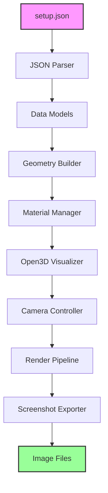
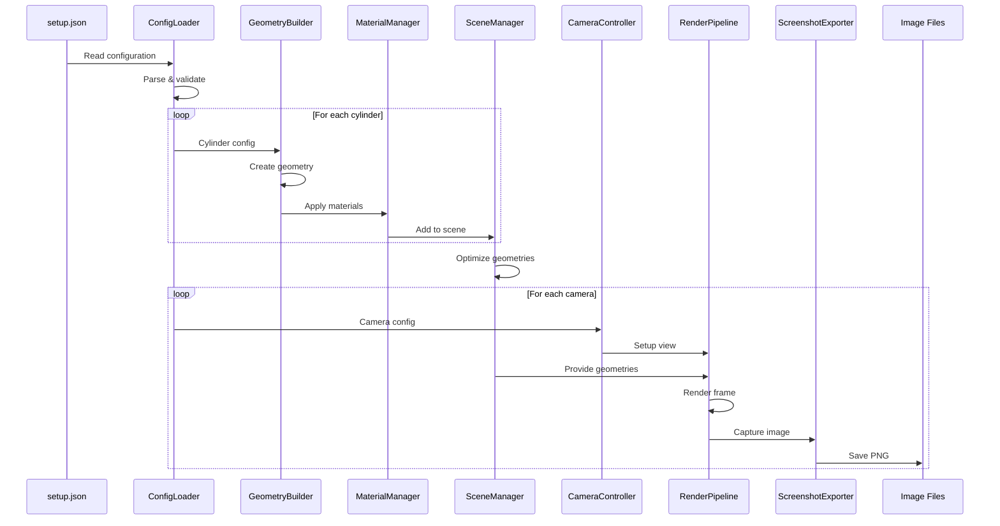

# Open3D 3D Rendering Architecture

## Executive Summary

This document outlines the architecture for a Python-based 3D rendering solution using Open3D that reads robot arm configuration from a JSON file and generates screenshots from multiple camera angles. Open3D provides a modern, efficient, and user-friendly library for 3D data processing with excellent support for point clouds, meshes, and visualization, making it ideal for rendering cylinder-based robot arm models.

## System Overview



## Core Components

### 1. Configuration Loader
**Purpose:** Parse and validate the setup.json file containing camera and cylinder definitions.

**Responsibilities:**
- Read JSON configuration from disk
- Validate JSON structure and data types
- Convert JSON data to Python data structures
- Handle parsing errors with descriptive messages
- Support configuration schema versioning

**Key Classes:**
```python
class ConfigurationLoader:
    def __init__(self, schema_version: str = "1.0"):
        self.schema_version = schema_version
        self.validators = self._initialize_validators()
    
    def load_config(self, filepath: str) -> SceneConfiguration
    def validate_schema(self, data: dict) -> bool
    def parse_cameras(self, camera_data: list) -> List[CameraConfig]
    def parse_cylinders(self, cylinder_data: list) -> List[CylinderConfig]
    def validate_color(self, color: str) -> bool
    def validate_coordinates(self, coords: list) -> bool
```

### 2. Data Models

#### SceneConfiguration
```python
from dataclasses import dataclass
from typing import List, Tuple
import numpy as np

@dataclass
class SceneConfiguration:
    cameras: List[CameraConfig]
    cylinders: List[CylinderConfig]
    
    def validate(self) -> bool:
        """Validate entire scene configuration"""
        return all(cam.validate() for cam in self.cameras) and \
               all(cyl.validate() for cyl in self.cylinders)

@dataclass
class CameraConfig:
    id: int
    name: str
    position: np.ndarray  # 3D position vector
    look_at: np.ndarray   # 3D focal point
    
    def __post_init__(self):
        self.position = np.array(self.position)
        self.look_at = np.array(self.look_at)
    
    def validate(self) -> bool:
        return self.position.shape == (3,) and self.look_at.shape == (3,)

@dataclass
class CylinderConfig:
    name: str
    radius: float
    color: str
    start_point: np.ndarray  # 3D start position
    end_point: np.ndarray    # 3D end position
    
    def __post_init__(self):
        self.start_point = np.array(self.start_point)
        self.end_point = np.array(self.end_point)
    
    def validate(self) -> bool:
        return self.radius > 0 and \
               np.linalg.norm(self.end_point - self.start_point) > 1e-6
```

### 3. Geometry Builder
**Purpose:** Create Open3D cylinder geometries from configuration data.

**Responsibilities:**
- Generate cylinder meshes from start/end points
- Calculate proper transformations and orientations
- Create mesh primitives with correct dimensions
- Optimize mesh quality for rendering

**Implementation:**
```python
import open3d as o3d
import numpy as np

class GeometryBuilder:
    def __init__(self, resolution: int = 32):
        self.resolution = resolution  # Cylinder resolution
    
    def create_cylinder(self, config: CylinderConfig) -> o3d.geometry.TriangleMesh:
        """Create a cylinder mesh from configuration"""
        # Calculate cylinder parameters
        start = config.start_point
        end = config.end_point
        height = np.linalg.norm(end - start)
        center = (start + end) / 2
        
        # Create base cylinder (along Z-axis)
        cylinder = o3d.geometry.TriangleMesh.create_cylinder(
            radius=config.radius,
            height=height,
            resolution=self.resolution,
            split=4
        )
        
        # Calculate rotation to align with desired axis
        direction = (end - start) / height
        z_axis = np.array([0, 0, 1])
        
        if not np.allclose(direction, z_axis):
            rotation_axis = np.cross(z_axis, direction)
            rotation_angle = np.arccos(np.clip(np.dot(z_axis, direction), -1, 1))
            
            # Create rotation matrix
            rotation_matrix = o3d.geometry.get_rotation_matrix_from_axis_angle(
                rotation_axis * rotation_angle
            )
            cylinder.rotate(rotation_matrix, center=[0, 0, 0])
        
        # Translate to correct position
        cylinder.translate(center)
        
        # Apply color
        color_rgb = self._get_color_rgb(config.color)
        cylinder.paint_uniform_color(color_rgb)
        
        # Compute normals for proper lighting
        cylinder.compute_vertex_normals()
        
        return cylinder
    
    def _get_color_rgb(self, color_name: str) -> np.ndarray:
        """Convert color name to RGB values"""
        color_map = {
            'orange': [1.0, 0.647, 0.0],
            'yellow': [1.0, 1.0, 0.0],
            'blue': [0.0, 0.0, 1.0],
            'green': [0.0, 1.0, 0.0],
            'red': [1.0, 0.0, 0.0],
            'purple': [0.5, 0.0, 0.5],
            'gray': [0.5, 0.5, 0.5]
        }
        return np.array(color_map.get(color_name.lower(), [0.5, 0.5, 0.5]))
```

### 4. Material Manager
**Purpose:** Handle material properties and visual appearance of cylinders.

**Responsibilities:**
- Configure material properties (metallic, roughness, glossiness)
- Set up proper shading models
- Handle transparency and reflectivity
- Optimize rendering quality

**Implementation:**
```python
class MaterialManager:
    def __init__(self):
        self.material_presets = self._create_presets()
    
    def _create_presets(self):
        return {
            'metal': {'metallic': 0.8, 'roughness': 0.2, 'reflectance': 0.9},
            'plastic': {'metallic': 0.0, 'roughness': 0.7, 'reflectance': 0.5},
            'rubber': {'metallic': 0.0, 'roughness': 0.9, 'reflectance': 0.1}
        }
    
    def apply_material(self, mesh: o3d.geometry.TriangleMesh, 
                      material_type: str = 'plastic'):
        """Apply material properties to mesh"""
        preset = self.material_presets.get(material_type, 
                                          self.material_presets['plastic'])
        
        # Open3D material properties are set through visualization
        # These will be used when creating the visualizer
        return preset
    
    def enhance_mesh_quality(self, mesh: o3d.geometry.TriangleMesh):
        """Enhance mesh quality for better rendering"""
        # Smooth mesh
        mesh = mesh.filter_smooth_simple(number_of_iterations=1)
        
        # Ensure proper normals
        mesh.compute_vertex_normals()
        
        # Remove duplicated vertices
        mesh.remove_duplicated_vertices()
        
        # Remove degenerate triangles
        mesh.remove_degenerate_triangles()
        
        return mesh
```

### 5. Scene Manager
**Purpose:** Manage the complete 3D scene composition and geometry organization.

**Responsibilities:**
- Organize all cylinder geometries
- Handle scene hierarchy
- Manage bounding boxes for camera setup
- Optimize scene for rendering

**Implementation:**
```python
class SceneManager:
    def __init__(self):
        self.geometries = []
        self.geometry_map = {}  # Map names to geometries
        self.scene_bounds = None
    
    def add_geometry(self, name: str, geometry: o3d.geometry.TriangleMesh):
        """Add a geometry to the scene"""
        self.geometries.append(geometry)
        self.geometry_map[name] = geometry
        self._update_bounds(geometry)
    
    def _update_bounds(self, geometry: o3d.geometry.TriangleMesh):
        """Update scene bounding box"""
        bbox = geometry.get_axis_aligned_bounding_box()
        if self.scene_bounds is None:
            self.scene_bounds = bbox
        else:
            self.scene_bounds = self.scene_bounds + bbox
    
    def get_scene_center(self) -> np.ndarray:
        """Get the center of the scene"""
        if self.scene_bounds:
            return self.scene_bounds.get_center()
        return np.array([0, 0, 0])
    
    def get_scene_scale(self) -> float:
        """Get appropriate scale for camera distance"""
        if self.scene_bounds:
            return np.linalg.norm(self.scene_bounds.get_extent())
        return 100.0
    
    def create_coordinate_frame(self, size: float = 10.0):
        """Create coordinate frame for reference"""
        return o3d.geometry.TriangleMesh.create_coordinate_frame(size=size)
    
    def optimize_for_rendering(self):
        """Optimize all geometries for rendering"""
        for geometry in self.geometries:
            geometry.compute_vertex_normals()
            geometry.remove_duplicated_vertices()
```

### 6. Camera Controller
**Purpose:** Manage camera positioning and view parameters for each defined camera.

**Responsibilities:**
- Set camera position and orientation
- Configure field of view and projection parameters
- Handle view matrix calculations
- Support orthographic and perspective projections

**Implementation:**
```python
class CameraController:
    def __init__(self):
        self.view_control = None
        self.camera_params = {}
    
    def setup_camera(self, vis: o3d.visualization.Visualizer, 
                    config: CameraConfig):
        """Setup camera with specific configuration"""
        view_control = vis.get_view_control()
        
        # Convert camera parameters to Open3D format
        camera_params = self._create_camera_parameters(config)
        
        # Apply camera parameters
        view_control.convert_from_pinhole_camera_parameters(camera_params)
        
        self.view_control = view_control
        self.camera_params[config.name] = camera_params
    
    def _create_camera_parameters(self, config: CameraConfig):
        """Create Open3D camera parameters"""
        params = o3d.camera.PinholeCameraParameters()
        
        # Set intrinsic parameters (can be customized)
        width, height = 1920, 1080
        fx = fy = width  # Focal length
        cx = width / 2
        cy = height / 2
        
        intrinsic = o3d.camera.PinholeCameraIntrinsic(
            width, height, fx, fy, cx, cy
        )
        
        # Set extrinsic parameters (view matrix)
        extrinsic = self._compute_extrinsic_matrix(
            config.position, 
            config.look_at
        )
        
        params.intrinsic = intrinsic
        params.extrinsic = extrinsic
        
        return params
    
    def _compute_extrinsic_matrix(self, eye: np.ndarray, 
                                  target: np.ndarray) -> np.ndarray:
        """Compute extrinsic matrix (world to camera transform)"""
        # Calculate camera coordinate system
        z = eye - target  # Camera looks along negative z
        z = z / np.linalg.norm(z)
        
        # Choose up vector based on camera position
        if abs(z[2]) > 0.9:  # Looking mostly up or down
            up = np.array([0, 1, 0])
        else:
            up = np.array([0, 0, 1])
        
        x = np.cross(up, z)
        x = x / np.linalg.norm(x)
        
        y = np.cross(z, x)
        y = y / np.linalg.norm(y)
        
        # Build extrinsic matrix
        extrinsic = np.eye(4)
        extrinsic[:3, 0] = x
        extrinsic[:3, 1] = y
        extrinsic[:3, 2] = z
        extrinsic[:3, 3] = eye
        
        # Invert to get world-to-camera transform
        return np.linalg.inv(extrinsic)
    
    def apply_preset_view(self, vis: o3d.visualization.Visualizer, 
                          preset: str):
        """Apply a preset camera view"""
        view_control = vis.get_view_control()
        
        presets = {
            'front': {'lookat': [0, 0, 0], 'front': [1, 0, 0], 'up': [0, 0, 1]},
            'back': {'lookat': [0, 0, 0], 'front': [-1, 0, 0], 'up': [0, 0, 1]},
            'top': {'lookat': [0, 0, 0], 'front': [0, 0, -1], 'up': [0, 1, 0]},
            'bottom': {'lookat': [0, 0, 0], 'front': [0, 0, 1], 'up': [0, 1, 0]},
            'left': {'lookat': [0, 0, 0], 'front': [0, -1, 0], 'up': [0, 0, 1]},
            'right': {'lookat': [0, 0, 0], 'front': [0, 1, 0], 'up': [0, 0, 1]}
        }
        
        if preset in presets:
            params = presets[preset]
            view_control.set_lookat(params['lookat'])
            view_control.set_front(params['front'])
            view_control.set_up(params['up'])
```

### 7. Render Pipeline
**Purpose:** Manage the Open3D rendering pipeline for high-quality output.

**Responsibilities:**
- Configure rendering options (anti-aliasing, shadows, ambient occlusion)
- Handle off-screen rendering
- Manage render quality settings
- Optimize rendering performance

**Implementation:**
```python
class RenderPipeline:
    def __init__(self, width: int = 1920, height: int = 1080):
        self.width = width
        self.height = height
        self.render_options = self._create_render_options()
    
    def _create_render_options(self):
        """Create rendering options"""
        opt = o3d.visualization.RenderOption()
        opt.background_color = np.array([1.0, 1.0, 1.0])  # White background
        opt.light_on = True
        opt.point_size = 1.0
        opt.line_width = 1.0
        opt.mesh_show_back_face = False
        opt.mesh_show_wireframe = False
        opt.mesh_shade_option = o3d.visualization.MeshShadeOption.Color
        return opt
    
    def create_offscreen_renderer(self) -> o3d.visualization.rendering.OffscreenRenderer:
        """Create off-screen renderer for headless operation"""
        renderer = o3d.visualization.rendering.OffscreenRenderer(
            self.width, self.height
        )
        
        # Setup rendering
        renderer.setup_camera(60, [0, 0, 0], [100, 100, 100], [0, 0, 1])
        
        # Configure lighting
        renderer.scene.set_lighting(
            o3d.visualization.rendering.Open3DScene.LightingProfile.BRIGHT_DAY_SUN
        )
        
        # Enable advanced rendering features
        renderer.scene.set_indirect_light_intensity(0.5)
        renderer.scene.enable_sun_light(True)
        
        return renderer
    
    def render_scene(self, renderer: o3d.visualization.rendering.OffscreenRenderer,
                    geometries: list, camera_params: dict) -> np.ndarray:
        """Render scene with given geometries and camera"""
        # Clear previous scene
        renderer.scene.clear_geometry()
        
        # Add geometries to scene
        for i, geometry in enumerate(geometries):
            material = o3d.visualization.rendering.MaterialRecord()
            material.shader = "defaultLit"
            material.base_color = [1.0, 1.0, 1.0, 1.0]
            
            renderer.scene.add_geometry(f"geometry_{i}", geometry, material)
        
        # Apply camera parameters
        if camera_params:
            intrinsic = camera_params.get('intrinsic')
            extrinsic = camera_params.get('extrinsic')
            if intrinsic and extrinsic:
                renderer.setup_camera(intrinsic, extrinsic)
        
        # Render and capture image
        image = renderer.render_to_image()
        return np.asarray(image)
    
    def apply_post_processing(self, image: np.ndarray) -> np.ndarray:
        """Apply post-processing effects to rendered image"""
        # Could add effects like anti-aliasing, color correction, etc.
        return image
```

### 8. Screenshot Exporter
**Purpose:** Capture and save rendered images with proper formatting and metadata.

**Responsibilities:**
- Capture rendered frames
- Save images in various formats (PNG, JPEG, etc.)
- Handle file naming conventions
- Add metadata to images
- Create output directory structure

**Implementation:**
```python
import os
from PIL import Image
from datetime import datetime

class ScreenshotExporter:
    def __init__(self, output_dir: str = "screenshots"):
        self.output_dir = output_dir
        self._ensure_output_directory()
    
    def _ensure_output_directory(self):
        """Create output directory if it doesn't exist"""
        os.makedirs(self.output_dir, exist_ok=True)
    
    def save_screenshot(self, image: np.ndarray, camera_name: str, 
                       format: str = 'png', add_metadata: bool = True):
        """Save screenshot with proper naming and metadata"""
        # Generate filename
        filename = f"{camera_name}_view.{format}"
        filepath = os.path.join(self.output_dir, filename)
        
        # Convert numpy array to PIL Image
        if image.dtype != np.uint8:
            image = (image * 255).astype(np.uint8)
        
        pil_image = Image.fromarray(image)
        
        # Add metadata if requested
        if add_metadata:
            metadata = self._create_metadata(camera_name)
            pil_image.info.update(metadata)
        
        # Save image
        pil_image.save(filepath, format.upper(), optimize=True)
        
        return filepath
    
    def _create_metadata(self, camera_name: str) -> dict:
        """Create metadata for image"""
        return {
            'Camera': camera_name,
            'Software': 'Open3D Renderer',
            'DateTime': datetime.now().isoformat(),
            'Description': f'3D rendered view from {camera_name}'
        }
    
    def save_batch_screenshots(self, images: dict, format: str = 'png'):
        """Save multiple screenshots at once"""
        saved_files = []
        for camera_name, image in images.items():
            filepath = self.save_screenshot(image, camera_name, format)
            saved_files.append(filepath)
        return saved_files
    
    def create_thumbnail(self, image: np.ndarray, size: tuple = (256, 256)):
        """Create thumbnail version of image"""
        pil_image = Image.fromarray(image)
        pil_image.thumbnail(size, Image.Resampling.LANCZOS)
        return np.array(pil_image)
```

### 9. Main Application Orchestrator
**Purpose:** Coordinate all components to execute the complete rendering pipeline.

**Implementation:**
```python
class Open3DRenderer:
    def __init__(self, config_path: str):
        self.config_loader = ConfigurationLoader()
        self.geometry_builder = GeometryBuilder()
        self.material_manager = MaterialManager()
        self.scene_manager = SceneManager()
        self.camera_controller = CameraController()
        self.render_pipeline = RenderPipeline()
        self.screenshot_exporter = ScreenshotExporter()
        
        # Load configuration
        self.config = self.config_loader.load_config(config_path)
    
    def build_scene(self):
        """Build the 3D scene from configuration"""
        for cylinder_config in self.config.cylinders:
            # Create cylinder geometry
            cylinder = self.geometry_builder.create_cylinder(cylinder_config)
            
            # Enhance mesh quality
            cylinder = self.material_manager.enhance_mesh_quality(cylinder)
            
            # Add to scene
            self.scene_manager.add_geometry(cylinder_config.name, cylinder)
        
        # Optimize scene for rendering
        self.scene_manager.optimize_for_rendering()
    
    def render_all_views(self):
        """Render scene from all configured cameras"""
        # Create off-screen renderer
        renderer = self.render_pipeline.create_offscreen_renderer()
        
        # Get all geometries
        geometries = self.scene_manager.geometries
        
        # Render from each camera
        images = {}
        for camera_config in self.config.cameras:
            # Setup camera
            camera_params = self.camera_controller._create_camera_parameters(
                camera_config
            )
            
            # Render scene
            image = self.render_pipeline.render_scene(
                renderer, geometries, {
                    'intrinsic': camera_params.intrinsic,
                    'extrinsic': camera_params.extrinsic
                }
            )
            
            # Apply post-processing
            image = self.render_pipeline.apply_post_processing(image)
            
            images[camera_config.name] = image
        
        # Save all screenshots
        self.screenshot_exporter.save_batch_screenshots(images)
        
        return images
    
    def run(self):
        """Execute the complete rendering pipeline"""
        print("Loading configuration...")
        
        print("Building 3D scene...")
        self.build_scene()
        
        print("Rendering views...")
        images = self.render_all_views()
        
        print(f"Successfully generated {len(images)} screenshots!")
        return images
```

## Data Flow



## Technical Stack

### Core Dependencies
```python
# requirements.txt
open3d>=0.18.0       # 3D data processing and visualization
numpy>=1.20.0        # Numerical operations
Pillow>=9.0.0        # Image processing and metadata
typing-extensions>=4.0.0  # Enhanced type hints
dataclasses>=0.6    # Data structure definitions (backport for Python 3.6)
```

### Optional Dependencies
```python
# requirements-dev.txt
pytest>=7.0.0        # Testing framework
pytest-cov>=3.0.0    # Coverage reporting
black>=22.0.0        # Code formatting
mypy>=0.950          # Static type checking
matplotlib>=3.5.0    # Additional plotting (for debugging)
jupyter>=1.0.0       # Interactive development
```

### System Requirements
- Python 3.8 or higher
- OpenGL 4.1+ support
- 4GB RAM minimum (8GB recommended)
- GPU with OpenGL support (recommended for performance)

## Implementation Strategy

### Phase 1: Foundation (Day 1)
1. **Project Setup**
   - Create directory structure
   - Set up virtual environment
   - Install dependencies
   - Initialize git repository

2. **Data Models Implementation**
   - Create configuration data classes
   - Implement validation logic
   - Add unit tests for models

3. **Configuration Loader**
   - Implement JSON parsing
   - Add schema validation
   - Create error handling

### Phase 2: Geometry Creation (Day 2)
1. **Geometry Builder**
   - Implement cylinder creation algorithm
   - Add transformation calculations
   - Test with simple geometries

2. **Material Manager**
   - Create color mapping system
   - Implement material presets
   - Add mesh quality enhancement

### Phase 3: Scene Management (Day 3)
1. **Scene Manager**
   - Implement geometry organization
   - Add bounding box calculations
   - Create scene optimization methods

2. **Integration Testing**
   - Test complete geometry pipeline
   - Verify scene composition
   - Validate transformations

### Phase 4: Camera System (Day 4)
1. **Camera Controller**
   - Implement camera positioning
   - Create view matrix calculations
   - Add camera presets

2. **Camera Testing**
   - Test all camera configurations
   - Verify view matrices
   - Validate field of view

### Phase 5: Rendering Pipeline (Day 5)
1. **Render Pipeline**
   - Set up off-screen rendering
   - Configure rendering options
   - Implement render loop

2. **Screenshot Exporter**
   - Create image capture logic
   - Add metadata support
   - Implement file saving

### Phase 6: Integration & Optimization (Day 6)
1. **Main Application**
   - Create orchestrator class
   - Implement complete pipeline
   - Add progress reporting

2. **Performance Optimization**
   - Profile rendering performance
   - Optimize geometry creation
   - Add caching where beneficial

3. **Documentation & Testing**
   - Complete API documentation
   - Add integration tests
   - Create usage examples

## File Structure

```
visualizer-try-2/
├── setup.json                  # Input configuration
├── open3d-architecture.md      # This document
├── main.py                     # Application entry point
├── requirements.txt            # Production dependencies
├── requirements-dev.txt        # Development dependencies
├── README.md                   # Project documentation
├── .gitignore                  # Git ignore rules
├── src/
│   ├── __init__.py
│   ├── config/
│   │   ├── __init__.py
│   │   ├── loader.py          # JSON configuration loader
│   │   ├── models.py          # Data model definitions
│   │   └── validators.py      # Validation utilities
│   ├── geometry/
│   │   ├── __init__.py
│   │   ├── builder.py         # Geometry creation
│   │   ├── transforms.py      # Transformation utilities
│   │   └── materials.py       # Material management
│   ├── scene/
│   │   ├── __init__.py
│   │   ├── manager.py         # Scene management
│   │   ├── optimizer.py       # Scene optimization
│   │   └── bounds.py          # Bounding box utilities
│   ├── camera/
│   │   ├── __init__.py
│   │   ├── controller.py      # Camera control
│   │   ├── presets.py         # Camera presets
│   │   └── matrices.py        # Matrix calculations
│   ├── rendering/
│   │   ├── __init__.py
│   │   ├── pipeline.py        # Render pipeline
│   │   ├── offscreen.py       # Off-screen rendering
│   │   └── options.py         # Render options
│   ├── export/
│   │   ├── __init__.py
│   │   ├── screenshot.py      # Screenshot capture
│   │   ├── metadata.py        # Image metadata
│   │   └── formats.py         # File format handlers
│   └── utils/
│       ├── __init__.py
│       ├── colors.py          # Color utilities
│       ├── logging.py         # Logging configuration
│       └── profiling.py       # Performance profiling
├── screenshots/                # Output directory
│   ├── top_camera_view.png
│   ├── front_camera_view.png
│   └── side_camera_view.png
├── tests/
│   ├── __init__.py
│   ├── conftest.py           # Pytest configuration
│   ├── unit/
│   │   ├── test_config_loader.py
│   │   ├── test_geometry_builder.py
│   │   ├── test_camera_controller.py
│   │   └── test_scene_manager.py
│   ├── integration/
│   │   ├── test_pipeline.py
│   │   └── test_rendering.py
│   └── fixtures/
│       ├── test_setup.json
│       └── expected_outputs/
├── examples/
│   ├── basic_usage.py
│   ├── custom_camera.py
│   └── batch_rendering.py
└── docs/
    ├── api/
    ├── user_guide.md
    └── troubleshooting.md
```

## Key Algorithms

### Cylinder Creation Algorithm
```python
def create_cylinder_between_points(start: np.ndarray, end: np.ndarray, 
                                   radius: float) -> o3d.geometry.TriangleMesh:
    """
    Create a cylinder mesh between two 3D points.
    
    The algorithm:
    1. Create a standard cylinder along Z-axis
    2. Calculate the rotation needed to align with target direction
    3. Apply rotation and translation
    """
    # Vector from start to end
    direction = end - start
    height = np.linalg.norm(direction)
    
    if height < 1e-6:
        raise ValueError("Start and end points are too close")
    
    # Normalize direction
    direction_normalized = direction / height
    
    # Create cylinder along Z-axis
    cylinder = o3d.geometry.TriangleMesh.create_cylinder(
        radius=radius,
        height=height,
        resolution=32,
        split=4
    )
    
    # Default cylinder axis (