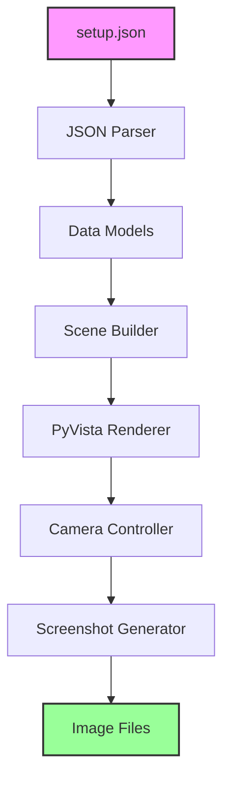
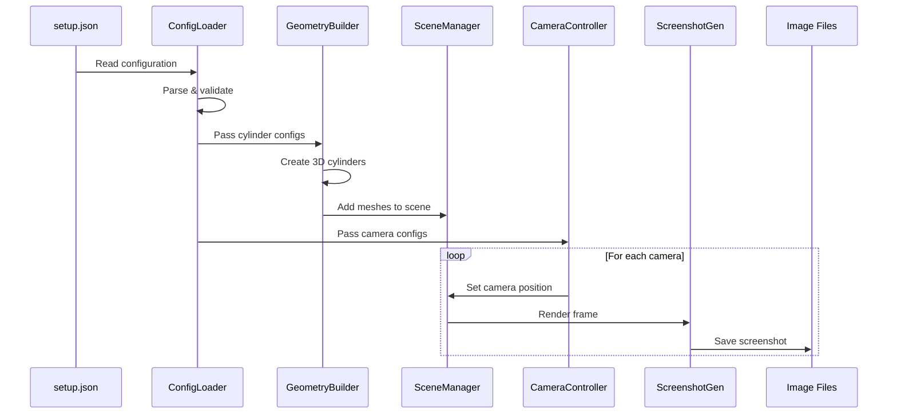

# PyVista 3D Rendering Architecture

## Executive Summary

This document outlines the architecture for a Python-based 3D rendering solution using PyVista that reads robot arm configuration from a JSON file and generates screenshots from multiple camera angles. The system visualizes cylinder primitives representing robot arm components with specified colors and dimensions.

## System Overview



## Core Components

### 1. Configuration Loader
**Purpose:** Parse and validate the setup.json file containing camera and cylinder definitions.

**Responsibilities:**
- Read JSON file from disk
- Validate JSON structure
- Convert JSON data to Python data structures
- Handle parsing errors gracefully

**Key Classes:**
- `ConfigLoader`: Main class for loading configuration
- `CameraConfig`: Data class for camera parameters
- `CylinderConfig`: Data class for cylinder parameters

### 2. Data Models

#### CameraConfig
```python
@dataclass
class CameraConfig:
    id: int
    name: str
    position: List[float]  # [x, y, z]
    look_at: List[float]   # [x, y, z]
```

#### CylinderConfig
```python
@dataclass
class CylinderConfig:
    name: str
    radius: float
    color: str
    start_point: List[float]  # [x, y, z]
    end_point: List[float]    # [x, y, z]
```

### 3. Geometry Builder
**Purpose:** Convert cylinder definitions into PyVista 3D objects.

**Responsibilities:**
- Calculate cylinder center, height, and direction from start/end points
- Create PyVista Cylinder objects with proper transformations
- Apply colors to cylinders
- Handle color name to RGB conversion

**Key Methods:**
- `create_cylinder_from_points()`: Convert start/end points to PyVista cylinder
- `calculate_cylinder_params()`: Compute center, height, direction vectors
- `apply_color()`: Map color names to RGB values

### 4. Scene Manager
**Purpose:** Manage the 3D scene composition and rendering pipeline.

**Responsibilities:**
- Initialize PyVista Plotter (off-screen mode for batch processing)
- Add all cylinder meshes to the scene
- Configure lighting and rendering settings
- Manage scene state

**Key Features:**
- Off-screen rendering for automated screenshot generation
- Configurable background color
- Anti-aliasing support
- Proper lighting setup

### 5. Camera Controller
**Purpose:** Handle camera positioning and view configuration.

**Responsibilities:**
- Set camera position for each defined camera
- Configure camera look-at point
- Calculate up vector automatically
- Reset camera view between shots

**Key Methods:**
- `setup_camera()`: Position camera based on configuration
- `reset_view()`: Clear previous camera settings
- `calculate_view_up()`: Determine appropriate up vector

### 6. Screenshot Generator
**Purpose:** Capture and save rendered images from each camera angle.

**Responsibilities:**
- Render scene from current camera position
- Capture frame buffer to image
- Save images with appropriate naming convention
- Handle file I/O operations
- Support multiple image formats (PNG recommended)

**Output Format:**
- Filename pattern: `{camera_name}_view.png`
- Directory: `./screenshots/` (created if not exists)

## Data Flow



## Technical Stack

### Core Dependencies
- **PyVista** (>=0.46.0): 3D plotting and mesh processing
- **NumPy**: Numerical operations and array handling
- **Pillow**: Image processing and saving
- **Python** (>=3.8): Core language runtime

### Optional Dependencies
- **VTK**: Underlying visualization toolkit (installed with PyVista)
- **matplotlib**: Additional plotting capabilities if needed
- **imageio**: Alternative image I/O library

## Implementation Strategy

### Phase 1: Foundation (Core Components)
1. Create data models for cameras and cylinders
2. Implement JSON configuration loader
3. Set up basic error handling and validation

### Phase 2: Geometry Processing
1. Implement cylinder creation from start/end points
2. Add color mapping functionality
3. Create geometry builder module

### Phase 3: Rendering Pipeline
1. Set up PyVista plotter in off-screen mode
2. Implement scene manager
3. Add cylinder meshes to scene

### Phase 4: Camera System
1. Implement camera positioning logic
2. Add look-at functionality
3. Handle multiple camera configurations

### Phase 5: Output Generation
1. Implement screenshot capture
2. Add file naming convention
3. Create output directory management

### Phase 6: Polish & Optimization
1. Add comprehensive error handling
2. Implement logging system
3. Optimize rendering performance
4. Add progress indicators

## File Structure

```
visualizer-try-2/
├── setup.json              # Input configuration
├── pyvista-architecture.md # This document
├── main.py                 # Entry point
├── src/
│   ├── __init__.py
│   ├── config_loader.py    # JSON parsing
│   ├── models.py           # Data classes
│   ├── geometry_builder.py # Cylinder creation
│   ├── scene_manager.py    # Scene composition
│   ├── camera_controller.py # Camera handling
│   └── screenshot_generator.py # Image capture
├── screenshots/            # Output directory
│   ├── top_camera_view.png
│   ├── front_camera_view.png
│   └── side_camera_view.png
├── utils/
│   ├── __init__.py
│   ├── colors.py           # Color utilities
│   └── validators.py       # Input validation
├── tests/
│   ├── test_config_loader.py
│   ├── test_geometry_builder.py
│   └── test_camera_controller.py
└── requirements.txt        # Dependencies

```

## Key Algorithms

### Cylinder Creation from Points
```python
def create_cylinder_from_points(start_point, end_point, radius):
    # Calculate center
    center = (np.array(start_point) + np.array(end_point)) / 2
    
    # Calculate height
    height = np.linalg.norm(np.array(end_point) - np.array(start_point))
    
    # Calculate direction vector
    direction = np.array(end_point) - np.array(start_point)
    direction = direction / np.linalg.norm(direction)
    
    # Create PyVista cylinder
    cylinder = pv.Cylinder(
        center=center,
        direction=direction,
        radius=radius,
        height=height
    )
    
    return cylinder
```

### Camera Positioning
```python
def setup_camera(plotter, camera_config):
    plotter.camera.position = camera_config.position
    plotter.camera.focal_point = camera_config.look_at
    
    # Auto-calculate up vector based on position
    if camera_config.position[2] > camera_config.look_at[2]:
        plotter.camera.up = (0, 1, 0)  # Y-up for top views
    else:
        plotter.camera.up = (0, 0, 1)  # Z-up for side views
```

## Color Mapping

Standard color mappings for the robot arm components:

| Color Name | RGB Value | Hex Code | Usage |
|------------|-----------|----------|--------|
| orange | (255, 165, 0) | #FFA500 | Base plate |
| yellow | (255, 255, 0) | #FFFF00 | Joints |
| blue | (0, 0, 255) | #0000FF | Arms |
| green | (0, 255, 0) | #00FF00 | Grippers |

## Error Handling

### Critical Errors (Program Termination)
- Missing or invalid setup.json file
- Invalid JSON structure
- Missing required fields in configuration

### Recoverable Errors (Warning & Continue)
- Unknown color name (default to gray)
- Invalid cylinder dimensions (skip cylinder)
- Failed screenshot save (retry or skip)

### Validation Rules
1. Camera positions must be 3D coordinates [x, y, z]
2. Cylinder radius must be positive
3. Start and end points must be different
4. Color must be a valid name or hex code

## Performance Considerations

### Optimization Strategies
1. **Off-screen Rendering**: Use `off_screen=True` to avoid GUI overhead
2. **Batch Processing**: Load all cylinders once, reuse for multiple camera angles
3. **Resolution Settings**: Configure screenshot resolution based on requirements
4. **Memory Management**: Clear scene between major operations
5. **Parallel Processing**: Consider concurrent screenshot generation for multiple cameras

### Expected Performance
- Setup time: < 1 second
- Per-cylinder creation: ~10ms
- Per-screenshot generation: ~100-500ms
- Total execution time for 3 cameras: < 3 seconds

## Testing Strategy

### Unit Tests
- Configuration parsing
- Cylinder geometry calculations
- Color mapping
- Camera positioning logic

### Integration Tests
- End-to-end rendering pipeline
- Multiple camera screenshot generation
- Error handling scenarios

### Visual Tests
- Manual inspection of generated screenshots
- Verification of cylinder positions
- Color accuracy checks

## Future Enhancements

### Potential Features
1. **Animation Support**: Generate video sequences with rotating cameras
2. **Interactive Mode**: GUI for real-time camera manipulation
3. **Additional Primitives**: Support for spheres, boxes, and custom meshes
4. **Texture Support**: Apply textures to cylinders
5. **Lighting Presets**: Multiple lighting configurations
6. **Configuration GUI**: Visual editor for setup.json
7. **Batch Processing**: Handle multiple configuration files
8. **Cloud Rendering**: Support for remote rendering servers

### Scalability Considerations
- Support for hundreds of cylinders
- Multiple scene configurations
- Distributed rendering for large batches
- Caching of pre-computed geometries

## Security Considerations

1. **Input Validation**: Sanitize all JSON inputs
2. **File System Access**: Restrict write operations to designated directories
3. **Resource Limits**: Cap maximum number of cylinders and cameras
4. **Error Messages**: Avoid exposing system paths in error outputs

## Conclusion

This architecture provides a robust, scalable foundation for a 3D rendering system that can visualize robot arm configurations from JSON specifications. The modular design allows for easy extension and maintenance, while the use of PyVista ensures high-quality rendering capabilities with minimal code complexity.

The system is designed to be:
- **Efficient**: Off-screen rendering and optimized geometry creation
- **Maintainable**: Clear separation of concerns and modular structure
- **Extensible**: Easy to add new features and primitives
- **Reliable**: Comprehensive error handling and validation

Next steps involve implementing the core modules according to this architecture and creating a comprehensive test suite to ensure reliability.