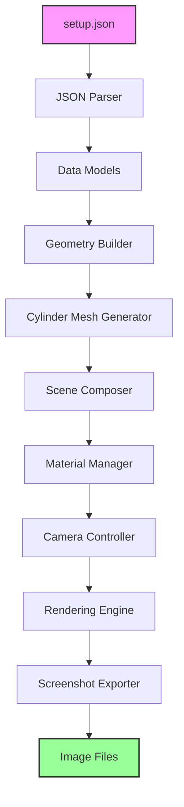
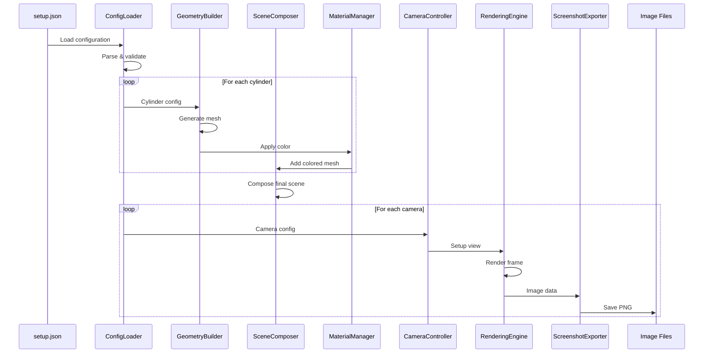

# Trimesh 3D Rendering Architecture

## Executive Summary

This document outlines the architecture for a Python-based 3D rendering solution using Trimesh that reads robot arm configuration from a JSON file and generates screenshots from multiple camera angles. Trimesh provides a lightweight, pure-Python approach to 3D geometry processing with excellent mesh manipulation capabilities and integration with various rendering backends. The system visualizes cylinder primitives representing robot arm components with specified colors and dimensions.

## System Overview



## Core Components

### 1. Configuration Loader
**Purpose:** Parse and validate the setup.json file containing camera and cylinder definitions.

**Responsibilities:**
- Read JSON file from disk using Python's json module
- Validate JSON structure against expected schema
- Convert JSON data to strongly-typed Python dataclasses
- Handle parsing errors with descriptive error messages
- Provide default values for optional parameters

**Key Classes:**
```python
class ConfigurationLoader:
    def load_config(self, filepath: str) -> SceneConfiguration
    def validate_schema(self, data: dict) -> bool
    def parse_cameras(self, camera_data: list) -> List[CameraConfig]
    def parse_cylinders(self, cylinder_data: list) -> List[CylinderConfig]
    def validate_coordinates(self, points: list) -> bool
```

### 2. Data Models

#### SceneConfiguration
```python
from dataclasses import dataclass
from typing import List, Tuple

@dataclass
class SceneConfiguration:
    cameras: List[CameraConfig]
    cylinders: List[CylinderConfig]
    render_settings: RenderSettings
    
@dataclass
class CameraConfig:
    id: int
    name: str
    position: Tuple[float, float, float]
    look_at: Tuple[float, float, float]
    fov: float = 45.0  # Field of view in degrees
    
@dataclass
class CylinderConfig:
    name: str
    radius: float
    color: str
    start_point: Tuple[float, float, float]
    end_point: Tuple[float, float, float]
    resolution: int = 32  # Segments for cylinder mesh

@dataclass
class RenderSettings:
    width: int = 1920
    height: int = 1080
    background_color: Tuple[float, float, float] = (0.9, 0.9, 0.9)
    lighting_intensity: float = 1.0
```

### 3. Geometry Builder
**Purpose:** Create Trimesh geometry objects from configuration data.

**Responsibilities:**
- Generate cylinder meshes using Trimesh primitives
- Calculate proper transformations for cylinder orientation
- Combine multiple meshes into a single scene
- Optimize mesh data for rendering

**Key Implementation:**
```python
import trimesh
import numpy as np

class GeometryBuilder:
    def build_cylinder_mesh(self, config: CylinderConfig) -> trimesh.Trimesh:
        """Create a cylinder mesh from configuration."""
        start = np.array(config.start_point)
        end = np.array(config.end_point)
        
        # Calculate cylinder parameters
        height = np.linalg.norm(end - start)
        center = (start + end) / 2.0
        
        # Create cylinder primitive
        cylinder = trimesh.creation.cylinder(
            radius=config.radius,
            height=height,
            sections=config.resolution
        )
        
        # Apply transformation
        transform = self.calculate_transform(start, end, center)
        cylinder.apply_transform(transform)
        
        return cylinder
    
    def calculate_transform(self, start: np.ndarray, 
                           end: np.ndarray, 
                           center: np.ndarray) -> np.ndarray:
        """Calculate transformation matrix for cylinder orientation."""
        # Implementation details below
        pass
```

### 4. Cylinder Mesh Generator
**Purpose:** Generate optimized cylinder meshes with proper UV mapping and normals.

**Responsibilities:**
- Create cylinder geometry with configurable resolution
- Generate proper UV coordinates for texture mapping
- Calculate smooth normals for lighting
- Handle edge cases (zero-height cylinders, etc.)

**Trimesh Cylinder Creation:**
```python
class CylinderMeshGenerator:
    def create_cylinder(self, config: CylinderConfig) -> trimesh.Trimesh:
        """Generate a cylinder mesh between two points."""
        start = np.array(config.start_point)
        end = np.array(config.end_point)
        
        # Calculate cylinder axis
        axis = end - start
        height = np.linalg.norm(axis)
        
        if height < 1e-6:
            # Handle degenerate case
            return trimesh.creation.icosphere(
                radius=config.radius,
                subdivisions=2
            )
        
        # Normalize axis
        axis_normalized = axis / height
        
        # Create base cylinder (along Z-axis)
        cylinder = trimesh.creation.cylinder(
            radius=config.radius,
            height=height,
            sections=config.resolution,
            centered=True
        )
        
        # Calculate rotation from Z-axis to target axis
        z_axis = np.array([0, 0, 1])
        rotation_matrix = self.rotation_matrix_from_vectors(
            z_axis, axis_normalized
        )
        
        # Create transformation matrix
        transform = np.eye(4)
        transform[:3, :3] = rotation_matrix
        transform[:3, 3] = (start + end) / 2.0
        
        # Apply transformation
        cylinder.apply_transform(transform)
        
        return cylinder
    
    def rotation_matrix_from_vectors(self, vec1: np.ndarray, 
                                    vec2: np.ndarray) -> np.ndarray:
        """Find rotation matrix that aligns vec1 to vec2."""
        a = vec1 / np.linalg.norm(vec1)
        b = vec2 / np.linalg.norm(vec2)
        v = np.cross(a, b)
        c = np.dot(a, b)
        s = np.linalg.norm(v)
        
        if s < 1e-6:
            # Vectors are parallel
            if c > 0:
                return np.eye(3)
            else:
                # Vectors are opposite, rotate 180 degrees
                return -np.eye(3)
        
        vx = np.array([[0, -v[2], v[1]],
                      [v[2], 0, -v[0]],
                      [-v[1], v[0], 0]])
        
        return np.eye(3) + vx + vx @ vx * ((1 - c) / (s ** 2))
```

### 5. Scene Composer
**Purpose:** Combine individual meshes into a complete scene with proper hierarchy.

**Responsibilities:**
- Merge cylinder meshes into a single scene
- Maintain mesh metadata (names, materials)
- Optimize scene graph for rendering
- Handle mesh instancing for repeated geometries

**Implementation:**
```python
class SceneComposer:
    def compose_scene(self, cylinders: List[Tuple[CylinderConfig, trimesh.Trimesh]]) -> trimesh.Scene:
        """Compose individual meshes into a scene."""
        scene = trimesh.Scene()
        
        for config, mesh in cylinders:
            # Set mesh metadata
            mesh.metadata['name'] = config.name
            mesh.metadata['color'] = config.color
            
            # Add to scene with unique name
            scene.add_geometry(mesh, node_name=config.name)
        
        # Optimize scene
        scene.apply_transform(np.eye(4))  # Ensure consistent transforms
        
        return scene
    
    def add_lighting(self, scene: trimesh.Scene):
        """Add lighting configuration to scene."""
        # Trimesh scenes can store lighting info in metadata
        scene.metadata['lights'] = [
            {
                'type': 'directional',
                'direction': [0.5, 0.5, -1],
                'intensity': 1.0,
                'color': [1, 1, 1]
            },
            {
                'type': 'ambient',
                'intensity': 0.3,
                'color': [1, 1, 1]
            }
        ]
```

### 6. Material Manager
**Purpose:** Apply colors and materials to mesh objects.

**Responsibilities:**
- Convert color names to RGB values
- Apply vertex colors or face colors to meshes
- Handle material properties (metallic, roughness)
- Support both named colors and RGB values

**Color Mapping:**
```python
class MaterialManager:
    COLOR_MAP = {
        'orange': [255, 165, 0, 255],
        'yellow': [255, 255, 0, 255],
        'blue': [0, 0, 255, 255],
        'green': [0, 255, 0, 255],
        'red': [255, 0, 0, 255],
        'purple': [128, 0, 128, 255],
        'cyan': [0, 255, 255, 255],
        'magenta': [255, 0, 255, 255],
        'white': [255, 255, 255, 255],
        'black': [0, 0, 0, 255],
        'gray': [128, 128, 128, 255],
    }
    
    def apply_color(self, mesh: trimesh.Trimesh, color_name: str):
        """Apply color to mesh vertices or faces."""
        rgba = self.COLOR_MAP.get(color_name, [128, 128, 128, 255])
        
        # Apply as vertex colors for smooth shading
        mesh.visual.vertex_colors = rgba
        
        # Alternative: Apply as face colors
        # mesh.visual.face_colors = rgba
        
        # Store material properties
        mesh.metadata['material'] = {
            'color': rgba,
            'metallic': 0.2,
            'roughness': 0.8
        }
    
    def parse_color(self, color_spec: str) -> np.ndarray:
        """Parse color specification (name or hex)."""
        if color_spec.startswith('#'):
            # Parse hex color
            return self.hex_to_rgba(color_spec)
        else:
            # Use named color
            return np.array(self.COLOR_MAP.get(
                color_spec, [128, 128, 128, 255]
            )) / 255.0
```

### 7. Camera Controller
**Purpose:** Configure camera parameters for different viewing angles.

**Responsibilities:**
- Calculate camera transformation matrices
- Determine view and projection matrices
- Handle field of view and aspect ratio
- Calculate appropriate up vectors

**Camera Implementation:**
```python
class CameraController:
    def setup_camera(self, config: CameraConfig, 
                    aspect_ratio: float) -> dict:
        """Setup camera parameters for rendering."""
        position = np.array(config.position)
        look_at = np.array(config.look_at)
        
        # Calculate camera vectors
        forward = look_at - position
        forward = forward / np.linalg.norm(forward)
        
        # Calculate up vector
        world_up = np.array([0, 0, 1])
        right = np.cross(forward, world_up)
        
        if np.linalg.norm(right) < 1e-6:
            # Camera looking straight up or down
            world_up = np.array([0, 1, 0])
            right = np.cross(forward, world_up)
        
        right = right / np.linalg.norm(right)
        up = np.cross(right, forward)
        
        # Create view matrix
        view_matrix = self.look_at_matrix(position, look_at, up)
        
        # Create projection matrix
        projection_matrix = self.perspective_matrix(
            config.fov, aspect_ratio, 0.1, 1000.0
        )
        
        return {
            'position': position,
            'look_at': look_at,
            'up': up,
            'view_matrix': view_matrix,
            'projection_matrix': projection_matrix,
            'fov': config.fov
        }
    
    def look_at_matrix(self, eye: np.ndarray, 
                      center: np.ndarray, 
                      up: np.ndarray) -> np.ndarray:
        """Create look-at view matrix."""
        f = center - eye
        f = f / np.linalg.norm(f)
        
        s = np.cross(f, up)
        s = s / np.linalg.norm(s)
        
        u = np.cross(s, f)
        
        result = np.eye(4)
        result[0, :3] = s
        result[1, :3] = u
        result[2, :3] = -f
        result[:3, 3] = -np.dot(result[:3, :3], eye)
        
        return result
```

### 8. Rendering Engine
**Purpose:** Interface with Trimesh's rendering backends to generate images.

**Responsibilities:**
- Select appropriate rendering backend (PyRender, OpenGL, etc.)
- Configure rendering parameters
- Handle render buffer management
- Support multiple rendering modes

**Rendering Options:**
```python
class RenderingEngine:
    def __init__(self, backend='pyrender'):
        """Initialize rendering engine with specified backend."""
        self.backend = backend
        
        if backend == 'pyrender':
            import pyrender
            self.renderer = self.setup_pyrender()
        elif backend == 'opengl':
            self.renderer = self.setup_opengl()
        elif backend == 'simple':
            # Use Trimesh's simple viewer
            self.renderer = None
    
    def setup_pyrender(self):
        """Setup PyRender for off-screen rendering."""
        import pyrender
        
        # Create off-screen renderer
        renderer = pyrender.OffscreenRenderer(
            viewport_width=1920,
            viewport_height=1080,
            point_size=1.0
        )
        return renderer
    
    def render_scene(self, scene: trimesh.Scene, 
                    camera_params: dict) -> np.ndarray:
        """Render scene from specified camera position."""
        if self.backend == 'pyrender':
            return self.render_with_pyrender(scene, camera_params)
        elif self.backend == 'simple':
            return self.render_simple(scene, camera_params)
    
    def render_with_pyrender(self, scene: trimesh.Scene, 
                            camera_params: dict) -> np.ndarray:
        """Render using PyRender backend."""
        import pyrender
        
        # Convert Trimesh scene to PyRender scene
        pyrender_scene = pyrender.Scene.from_trimesh_scene(scene)
        
        # Add camera
        camera = pyrender.PerspectiveCamera(
            yfov=np.radians(camera_params['fov']),
            aspectRatio=1920/1080
        )
        
        camera_pose = np.eye(4)
        camera_pose[:3, 3] = camera_params['position']
        # Additional pose configuration
        
        pyrender_scene.add(camera, pose=camera_pose)
        
        # Add lighting
        light = pyrender.DirectionalLight(
            color=[1.0, 1.0, 1.0],
            intensity=3.0
        )
        pyrender_scene.add(light, pose=np.eye(4))
        
        # Render
        color, depth = self.renderer.render(pyrender_scene)
        
        return color
    
    def render_simple(self, scene: trimesh.Scene, 
                     camera_params: dict) -> np.ndarray:
        """Use Trimesh's built-in simple rendering."""
        # Get scene bounds for camera positioning
        bounds = scene.bounds
        
        # Use Trimesh's scene.save_image for simple rendering
        # This is a simplified approach
        from PIL import Image
        import io
        
        # Export scene to image buffer
        png = scene.save_image(resolution=[1920, 1080])
        
        # Convert to numpy array
        image = Image.open(io.BytesIO(png))
        return np.array(image)
```

### 9. Screenshot Exporter
**Purpose:** Save rendered images to disk with appropriate naming and format.

**Responsibilities:**
- Convert render buffers to image format
- Apply post-processing (gamma correction, etc.)
- Save images with proper naming convention
- Handle different image formats (PNG, JPEG, etc.)
- Create output directories as needed

**Implementation:**
```python
class ScreenshotExporter:
    def __init__(self, output_dir: str = 'screenshots'):
        """Initialize exporter with output directory."""
        self.output_dir = Path(output_dir)
        self.output_dir.mkdir(parents=True, exist_ok=True)
    
    def save_screenshot(self, image_data: np.ndarray, 
                       camera_name: str,
                       format: str = 'png'):
        """Save rendered image to file."""
        from PIL import Image
        
        # Ensure image data is in correct format
        if image_data.dtype != np.uint8:
            # Convert from float [0,1] to uint8 [0,255]
            image_data = (image_data * 255).astype(np.uint8)
        
        # Create PIL image
        image = Image.fromarray(image_data)
        
        # Apply post-processing
        image = self.apply_post_processing(image)
        
        # Generate filename
        filename = f"{camera_name}_view.{format}"
        filepath = self.output_dir / filename
        
        # Save image
        image.save(filepath, quality=95 if format == 'jpg' else None)
        
        return filepath
    
    def apply_post_processing(self, image: Image) -> Image:
        """Apply post-processing effects to rendered image."""
        # Optional: Apply gamma correction
        # Optional: Adjust brightness/contrast
        # Optional: Apply anti-aliasing
        return image
    
    def export_batch(self, renders: List[Tuple[np.ndarray, str]]):
        """Export multiple screenshots in batch."""
        results = []
        for image_data, camera_name in renders:
            filepath = self.save_screenshot(image_data, camera_name)
            results.append(filepath)
        return results
```

## Data Flow Architecture



## Implementation Strategy

### Phase 1: Core Infrastructure (Day 1)
1. **Setup Project Structure**
   ```bash
   visualizer-try-2/
   ├── main.py
   ├── requirements.txt
   ├── setup.json
   ├── trimesh-architecture.md
   ├── src/
   │   ├── __init__.py
   │   ├── config/
   │   │   ├── __init__.py
   │   │   ├── loader.py
   │   │   └── models.py
   │   ├── geometry/
   │   │   ├── __init__.py
   │   │   ├── builder.py
   │   │   └── cylinder.py
   │   ├── rendering/
   │   │   ├── __init__.py
   │   │   ├── camera.py
   │   │   ├── engine.py
   │   │   └── materials.py
   │   ├── scene/
   │   │   ├── __init__.py
   │   │   └── composer.py
   │   └── export/
   │       ├── __init__.py
   │       └── screenshot.py
   ├── screenshots/
   └── tests/
       ├── __init__.py
       ├── test_geometry.py
       ├── test_rendering.py
       └── test_integration.py
   ```

2. **Install Dependencies**
   ```bash
   pip install trimesh[easy]  # Includes most rendering backends
   pip install numpy pillow
   pip install pyrender  # For high-quality rendering
   pip install pyglet  # For OpenGL context
   ```

3. **Implement Data Models**
   - Create dataclasses for configuration
   - Add validation decorators
   - Implement type hints

### Phase 2: Geometry Generation (Day 1-2)
1. **Cylinder Mesh Generator**
   - Implement rotation matrix calculation
   - Handle edge cases
   - Optimize mesh generation

2. **Geometry Builder**
   - Create transform calculation
   - Implement mesh combination
   - Add mesh validation

### Phase 3: Scene Composition (Day 2)
1. **Scene Composer**
   - Implement scene graph management
   - Add mesh organization
   - Optimize scene structure

2. **Material Manager**
   - Create color mapping
   - Implement material properties
   - Add visual effects

### Phase 4: Rendering Pipeline (Day 2-3)
1. **Camera Controller**
   - Implement view matrix calculation
   - Add projection matrix generation
   - Handle camera constraints

2. **Rendering Engine**
   - Setup PyRender backend
   - Implement fallback renderers
   - Add render quality settings

### Phase 5: Output Generation (Day 3)
1. **Screenshot Exporter**
   - Implement image saving
   - Add post-processing pipeline
   - Create batch export

2. **Integration**
   - Connect all components
   - Add error handling
   - Implement logging

### Phase 6: Testing & Optimization (Day 3-4)
1. **Unit Tests**
   - Test individual components
   - Validate transformations
   - Check color mapping

2. **Integration Tests**
   - End-to-end rendering
   - Performance benchmarks
   - Visual verification

## Key Algorithms

### Cylinder Orientation Algorithm
```python
def orient_cylinder(start_point: np.ndarray, 
                   end_point: np.ndarray) -> np.ndarray:
    """
    Calculate transformation matrix to orient cylinder
    from start_point to end_point.
    """
    # Calculate cylinder axis
    axis = end_point - start_point
    height = np.linalg.norm(axis)
    
    if height < 1e-6:
        return np.eye(4)
    
    axis_normalized = axis / height
    
    # Default cylinder is along Z-axis
    z_axis = np.array([0, 0, 1])
    
    # Calculate rotation using Rodrigues' formula
    v = np.cross(z_axis, axis_normalized)
    s = np.linalg.norm(v)
    c = np.dot(z_axis, axis_normalized)
    
    if s < 1e-6:
        # Parallel or anti-parallel
        if c > 0:
            rotation = np.eye(3)
        else:
            # 180-degree rotation around any perpendicular axis
            if abs(z_axis[0]) < 0.9:
                perp = np.array([1, 0, 0])
            else:
                perp = np.array([0, 1, 0])
            rotation = 2 * np.outer(perp, perp) - np.eye(3)
    else:
        vx = np.array([[0, -v[2], v[1]],
                      [v[2], 0, -v[0]],
                      [-v[1], v[0], 0]])
        rotation = np.eye(3) + vx + vx @ vx * ((1 - c) / (s ** 2))
    
    # Build transformation matrix
    transform = np.eye(4)
    transform[:3, :3] = rotation
    transform[:3, 3] = (start_point + end_point) / 2.0
    
    return transform
```

### Main Application Flow
```python
def main():
    """Main application entry point."""
    import argparse
    from pathlib import Path
    
    # Parse arguments
    parser = argparse.ArgumentParser(
        description='3D Robot Arm Visualizer using Trimesh'
    )
    parser.add_argument(
        '--config', 
        default='setup.json',
        help='Path to configuration file'
    )
    parser.add_argument(
        '--output', 
        default='screenshots',
        help='Output directory for screenshots'
    )
    parser.add_argument(
        '--backend',
        default='pyrender',
        choices=['pyrender', 'opengl', 'simple'],
        help='Rendering backend to use'
    )
    args = parser.parse_args()
    
    # Load configuration
    loader = ConfigurationLoader()
    config = loader.load_config(args.config)
    
    # Build geometry
    builder = GeometryBuilder()
    cylinders = []
    
    for cylinder_config in config.cylinders:
        mesh = builder.build_cylinder_mesh(cylinder_config)
        cylinders.append((cylinder_config, mesh))
    
    # Apply materials
    material_manager = MaterialManager()
    for cylinder_config, mesh in cylinders:
        material_manager.apply_color(mesh, cylinder_config.color)
    
    # Compose scene
    composer = SceneComposer()
    scene = composer.compose_scene(cylinders)
    composer.add_lighting(scene)
    
    # Setup rendering
    engine = RenderingEngine(backend=args.backend)
    camera_controller = CameraController()
    exporter = ScreenshotExporter(args.output)
    
    # Render from each camera
    for camera_config in config.cameras:
        print(f"Rendering view: {camera_config.name}")
        
        # Setup camera
        camera_params = camera_controller.setup_camera(
            camera_config, 
            aspect_ratio=16/9
        )
        
        # Render scene
        image = engine.render_scene(scene, camera_params)
        
        # Save screenshot
        filepath = exporter.save_screenshot(
            image, 
            camera_config.name
        )
        print(f"  Saved: {filepath}")
    
    print(f"\nAll {len(config.cameras)} views rendered successfully!")
    
if __name__ == "__main__":
    main()
```

## Performance Optimization

### Mesh Optimization
1. **Vertex Sharing**
   - Use indexed vertices to reduce memory
   - Share vertices between adjacent faces
   - Optimize vertex ordering for cache efficiency

2. **Level of Detail (LOD)**
   ```python
   def create_lod_cylinder(config: CylinderConfig, 
                          distance: float) -> trimesh.Trimesh:
       """Create cylinder with appropriate detail level."""
       if distance < 50:
           sections = 32  # High detail
       elif distance < 100:
           sections = 16  # Medium detail
       else:
           sections = 8   # Low detail
       
       return trimesh.creation.cylinder(
           radius=config.radius,
           height=height,
           sections=sections
       )
   ```

3. **Mesh Instancing**
   - Reuse identical geometries
   - Apply different transforms to instances
   - Reduce memory footprint

### Rendering Optimization
1. **Frustum Culling**
   - Skip objects outside camera view
   - Use bounding box checks
   - Implement hierarchical culling

2. **Batch Processing**
   - Render multiple views in single session
   - Reuse scene data between renders
   - Minimize context switches

3. **Caching Strategy**
   ```python
   class MeshCache:
       def __init__(self):
           self.cache = {}
       
       def get_cylinder(self, key: str, 
                       generator: callable) -> trimesh.Trimesh:
           """Get cached mesh or generate new one."""
           if key not in self.cache:
               self.cache[key] = generator()
           return self.cache[key].copy()
   ```

## Error Handling

### Error Categories

#### Critical Errors
- Missing or invalid JSON file
- Trimesh initialization failure
- Rendering backend unavailable
- File write permissions denied

#### Recoverable Errors
- Unknown color name (use default)
- Invalid geometry (skip cylinder)
- Camera configuration issues (use defaults)
- Missing optional dependencies

### Error Handler Implementation
```python
class ErrorHandler:
    @staticmethod
    def handle_critical(error: Exception):
        """Handle critical errors requiring termination."""
        import traceback
        
        print(f"CRITICAL ERROR: {error}")
        print(f"Stack trace:\n{traceback.format_exc()}")
        
        # Log to file
        with open('error.log', 'a') as f:
            f.write(f"{datetime.now()}: {error}\n")
            f.write(traceback.format_exc())
        
        sys.exit(1)
    
    @staticmethod
    def handle_recoverable(error: Exception, 
                          context: str,
                          default=None):
        """Handle recoverable errors with fallback."""
        print(f"WARNING in {context}: {error}")
        print(f"  Using default value: {default}")
        
        return default
    
    @staticmethod
    def validate_mesh(mesh: trimesh.Trimesh) -> bool:
        """Validate mesh integrity."""
        if not mesh.is_valid:
            print(f"Invalid mesh detected")
            return False
        
        if not mesh.is_watertight:
            print(f"Mesh is not watertight")
            # This might be acceptable for cylinders
        
        return True
```

## Testing Strategy

### Unit Tests
```python
# test_geometry.py
import unittest
import numpy as np
import trimesh
from src.geometry.builder import GeometryBuilder

class TestGeometryBuilder(unittest.TestCase):
    def setUp(self):
        self.builder = GeometryBuilder()
    
    def test_cylinder_creation(self):
        """Test basic cylinder creation."""
        config = CylinderConfig(
            name="test",
            radius=5.0,
            color="blue",
            start_point=(0, 0, 0),
            end_point=(0, 0, 10)
        )
        mesh = self.builder.build_cylinder_mesh(config)
        
        # Check center position
        center = mesh.centroid
        expected_center = np.array([5, 5, 5])
        np.testing.assert_array_almost_equal(
            center, expected_center, decimal=1
        )
    
    def test_degenerate_cylinder(self):
        """Test handling of zero-height cylinder."""
        config = CylinderConfig(
            name="test",
            radius=3.0,
            color="green",
            start_point=(0, 0, 0),
            end_point=(0, 0, 0)
        )
        
        mesh = self.builder.build_cylinder_mesh(config)
        
        # Should create a sphere instead
        self.assertIsInstance(mesh, trimesh.Trimesh)
        self.assertTrue(mesh.is_valid)

class TestColorMapping(unittest.TestCase):
    def test_named_colors(self):
        """Test color name to RGB conversion."""
        manager = MaterialManager()
        
        test_cases = [
            ('orange', [255, 165, 0, 255]),
            ('yellow', [255, 255, 0, 255]),
            ('blue', [0, 0, 255, 255]),
            ('green', [0, 255, 0, 255]),
        ]
        
        for color_name, expected_rgb in test_cases:
            rgb = manager.COLOR_MAP[color_name]
            self.assertEqual(rgb, expected_rgb)
    
    def test_unknown_color(self):
        """Test fallback for unknown colors."""
        manager = MaterialManager()
        mesh = trimesh.creation.box()
        
        # Should use default gray
        manager.apply_color(mesh, 'unknown_color')
        
        # Check visual properties were set
        self.assertIsNotNone(mesh.visual.vertex_colors)
```

### Integration Tests
```python
# test_integration.py
import unittest
import tempfile
from pathlib import Path
from src.main import main

class TestEndToEnd(unittest.TestCase):
    def test_complete_pipeline(self):
        """Test complete rendering pipeline."""
        with tempfile.TemporaryDirectory() as tmpdir:
            # Run main application
            result = main(
                config_file='setup.json',
                output_dir=tmpdir,
                backend='simple'
            )
            
            # Check screenshots were created
            output_path = Path(tmpdir)
            screenshots = list(output_path.glob('*.png'))
            
            self.assertEqual(len(screenshots), 3)
            
            expected_files = [
                'top_camera_view.png',
                'front_camera_view.png',
                'side_camera_view.png'
            ]
            
            for expected in expected_files:
                filepath = output_path / expected
                self.assertTrue(filepath.exists())
                
                # Check file size (should be non-empty)
                self.assertGreater(filepath.stat().st_size, 0)
```

### Performance Tests
```python
# test_performance.py
import time
import unittest
from src.geometry.builder import GeometryBuilder

class TestPerformance(unittest.TestCase):
    def test_cylinder_generation_speed(self):
        """Test cylinder generation performance."""
        builder = GeometryBuilder()
        
        configs = [
            CylinderConfig(
                name=f"cylinder_{i}",
                radius=5.0,
                color="blue",
                start_point=(i, 0, 0),
                end_point=(i, 0, 10)
            )
            for i in range(100)
        ]
        
        start_time = time.time()
        
        meshes = []
        for config in configs:
            mesh = builder.build_cylinder_mesh(config)
            meshes.append(mesh)
        
        elapsed = time.time() - start_time
        
        # Should generate 100 cylinders in under 1 second
        self.assertLess(elapsed, 1.0)
        
        # Calculate average time per cylinder
        avg_time = elapsed / len(configs)
        print(f"Average time per cylinder: {avg_time*1000:.2f}ms")
```

## Benchmarks and Performance Metrics

### Expected Performance
| Operation | Target Time | Maximum Time |
|-----------|------------|--------------|
| JSON parsing | < 5ms | 20ms |
| Single cylinder generation | < 5ms | 15ms |
| Scene composition (8 cylinders) | < 50ms | 100ms |
| Camera setup | < 2ms | 10ms |
| Single frame render (PyRender) | < 200ms | 500ms |
| Single frame render (Simple) | < 100ms | 300ms |
| Screenshot save | < 50ms | 100ms |
| **Total (3 cameras, 8 cylinders)** | < 1s | 2s |

### Memory Usage
| Component | Expected | Maximum |
|-----------|----------|---------|
| Single cylinder mesh | ~10KB | 50KB |
| Complete scene (8 cylinders) | ~100KB | 500KB |
| Render buffer (1920x1080) | ~8MB | 16MB |
| Total application | < 100MB | 200MB |

## Dependencies

### Core Dependencies
```txt
# requirements.txt
trimesh>=3.20.0          # Core 3D library
numpy>=1.20.0            # Numerical operations
pillow>=9.0.0            # Image processing

# Rendering backends (choose one or more)
pyrender>=0.1.45         # High-quality rendering
pyglet>=2.0.0            # OpenGL context
networkx>=2.5            # Scene graph operations
scipy>=1.7.0             # Additional math operations

# Optional dependencies for enhanced features
matplotlib>=3.5.0        # Alternative visualization
scikit-image>=0.19.0     # Advanced image processing
```

### Installation Commands
```bash
# Basic installation
pip install trimesh[easy]

# Full installation with all features
pip install trimesh[all]

# Minimal installation
pip install trimesh numpy pillow

# With PyRender for high-quality rendering
pip install trimesh pyrender pyglet
```

## Trimesh-Specific Advantages

### 1. Pure Python Implementation
- No complex compilation required
- Easy to debug and modify
- Excellent for prototyping

### 2. Multiple Rendering Backends
- **PyRender**: High-quality, physically-based rendering
- **Pyglet**: Simple OpenGL rendering
- **Matplotlib**: 2D projections and wireframes
- **Scene.show()**: Interactive 3D viewer

### 3. Rich Geometry Operations
```python
# Example: Boolean operations
cylinder1 = trimesh.creation.cylinder(radius=5, height=10)
cylinder2 = trimesh.creation.cylinder(radius=3, height=15)
result = cylinder1.union(cylinder2)

# Example: Mesh analysis
mesh = trimesh.load('model.stl')
print(f"Volume: {mesh.volume}")
print(f"Surface area: {mesh.area}")
print(f"Is watertight: {mesh.is_watertight}")
print(f"Is convex: {mesh.is_convex}")
```

### 4. Scene Management
```python
# Trimesh scenes support hierarchical transformations
scene = trimesh.Scene()

# Add parent node
parent_transform = np.eye(4)
parent_transform[:3, 3] = [10, 0, 0]
scene.add_geometry(mesh1, node_name='parent',
                  transform=parent_transform)

# Add child node (inherits parent transform)
scene.graph.update(node_name='child',
                  parent_node='parent',
                  geometry=mesh2)
```

## Troubleshooting Guide

### Common Issues and Solutions

| Issue | Cause | Solution |
|-------|-------|----------|
| ImportError: No module named 'pyrender' | PyRender not installed | `pip install pyrender` |
| OSError: pyglet requires an X server | No display server (Linux) | Use `xvfb-run` or set backend to 'simple' |
| Black/empty screenshots | Camera misconfiguration | Check camera position and look_at vectors |
| Cylinders appear as lines | Zero radius or degenerate geometry | Validate cylinder dimensions |
| Wrong cylinder orientation | Incorrect transform calculation | Verify start/end points are different |
| Memory error with large scenes | Too many vertices | Reduce cylinder resolution |
| Slow rendering | High polygon count | Use LOD or simpler backend |

### Debug Mode Implementation
```python
class DebugMode:
    def __init__(self, enabled=False):
        self.enabled = enabled
    
    def log_mesh_info(self, mesh: trimesh.Trimesh, name: str):
        """Log detailed mesh information."""
        if not self.enabled:
            return
        
        print(f"\n=== Mesh Debug Info: {name} ===")
        print(f"Vertices: {len(mesh.vertices)}")
        print(f"Faces: {len(mesh.faces)}")
        print(f"Bounds: {mesh.bounds}")
        print(f"Centroid: {mesh.centroid}")
        print(f"Is valid: {mesh.is_valid}")
        print(f"Is watertight: {mesh.is_watertight}")
        print(f"Volume: {mesh.volume:.2f}")
        print(f"Surface area: {mesh.area:.2f}")
    
    def visualize_intermediate(self, scene: trimesh.Scene,
                              title: str):
        """Show intermediate scene state."""
        if not self.enabled:
            return
        
        print(f"\nShowing intermediate scene: {title}")
        scene.show()  # Opens interactive viewer
```

## Security Considerations

### Input Validation
```python
class InputValidator:
    MAX_CYLINDERS = 1000
    MAX_CAMERAS = 100
    MAX_COORDINATE = 10000
    MIN_RADIUS = 0.001
    MAX_RADIUS = 1000
    
    @classmethod
    def validate_config(cls, config: dict) -> bool:
        """Validate configuration against security constraints."""
        # Check array sizes
        if len(config.get('cylinders', [])) > cls.MAX_CYLINDERS:
            raise ValueError(f"Too many cylinders (max: {cls.MAX_CYLINDERS})")
        
        if len(config.get('cameras', [])) > cls.MAX_CAMERAS:
            raise ValueError(f"Too many cameras (max: {cls.MAX_CAMERAS})")
        
        # Validate cylinders
        for cylinder in config.get('cylinders', []):
            cls.validate_cylinder(cylinder)
        
        # Validate cameras
        for camera in config.get('cameras', []):
            cls.validate_camera(camera)
        
        return True
    
    @classmethod
    def validate_cylinder(cls, cylinder: dict):
        """Validate individual cylinder configuration."""
        radius = cylinder.get('radius', 0)
        if not cls.MIN_RADIUS <= radius <= cls.MAX_RADIUS:
            raise ValueError(f"Invalid radius: {radius}")
        
        for point_key in ['start_point', 'end_point']:
            point = cylinder.get(point_key, [])
            for coord in point:
                if abs(coord) > cls.MAX_COORDINATE:
                    raise ValueError(f"Coordinate out of range: {coord}")
```

### Resource Limits
```python
class ResourceLimiter:
    def __init__(self):
        self.max_memory_mb = 500
        self.max_vertices = 1_000_000
        self.max_render_time = 10.0  # seconds
    
    def check_memory_usage(self):
        """Monitor memory usage."""
        import psutil
        process = psutil.Process()
        memory_mb = process.memory_info().rss / 1024 / 1024
        
        if memory_mb > self.max_memory_mb:
            raise MemoryError(f"Memory limit exceeded: {memory_mb:.1f}MB")
    
    def check_scene_complexity(self, scene: trimesh.Scene):
        """Check scene complexity limits."""
        total_vertices = sum(
            len(mesh.vertices)
            for mesh in scene.geometry.values()
        )
        
        if total_vertices > self.max_vertices:
            raise ValueError(f"Scene too complex: {total_vertices} vertices")
```

## Extended Features and Enhancements

### 1. Animation Support
```python
class AnimationRenderer:
    def render_rotation_sequence(self, scene: trimesh.Scene,
                                camera_config: CameraConfig,
                                frames: int = 36):
        """Render rotating view sequence."""
        images = []
        
        for i in range(frames):
            angle = (i / frames) * 2 * np.pi
            
            # Rotate camera around Z-axis
            position = np.array([
                np.cos(angle) * 50,
                np.sin(angle) * 50,
                camera_config.position[2]
            ])
            
            modified_config = CameraConfig(
                id=camera_config.id,
                name=f"{camera_config.name}_frame_{i:03d}",
                position=tuple(position),
                look_at=camera_config.look_at
            )
            
            image = self.render_single_frame(scene, modified_config)
            images.append(image)
        
        return images
```

### 2. Interactive Viewer
```python
def launch_interactive_viewer(scene: trimesh.Scene):
    """Launch interactive 3D viewer."""
    # Add axes for reference
    axes = trimesh.creation.axis(axis_length=20)
    scene.add_geometry(axes)
    
    # Configure viewer
    viewer_config = {
        'background': [0.9, 0.9, 0.9, 1.0],
        'window_title': 'Robot Arm Visualizer',
        'width': 1280,
        'height': 720,
        'start_loop': True
    }
    
    # Launch viewer
    scene.show(**viewer_config)
```

### 3. Export Formats
```python
class FormatExporter:
    @staticmethod
    def export_to_multiple_formats(scene: trimesh.Scene,
                                  base_name: str):
        """Export scene to multiple 3D formats."""
        formats = {
            'glb': 'model/gltf-binary',
            'obj': 'model/obj',
            'stl': 'model/stl',
            'ply': 'model/ply',
            'dae': 'model/vnd.collada+xml'
        }
        
        for extension, mime_type in formats.items():
            filename = f"{base_name}.{extension}"
            scene.export(filename, file_type=mime_type)
            print(f"Exported: {filename}")
```

### 4. Advanced Materials
```python
class AdvancedMaterialManager:
    def apply_pbr_material(self, mesh: trimesh.Trimesh,
                          material_config: dict):
        """Apply physically-based rendering materials."""
        material = trimesh.visual.material.PBRMaterial(
            baseColorFactor=material_config.get('color', [0.5, 0.5, 0.5, 1.0]),
            metallicFactor=material_config.get('metallic', 0.0),
            roughnessFactor=material_config.get('roughness', 0.5),
            emissiveFactor=material_config.get('emissive', [0, 0, 0])
        )
        
        mesh.visual = trimesh.visual.TextureVisuals(material=material)
```

## Comparison with Other Solutions

### Trimesh vs VTK
| Feature | Trimesh | VTK |
|---------|---------|-----|
| Learning curve | Gentle | Steep |
| Python integration | Native | Wrapped C++ |
| Installation | Simple pip | Complex dependencies |
| Performance | Good | Excellent |
| Features | Focused on meshes | Comprehensive |
| Documentation | Good | Extensive |
| Community | Growing | Large |

### Trimesh vs Open3D
| Feature | Trimesh | Open3D |
|---------|---------|--------|
| Pure Python | Yes | No (C++ core) |
| Mesh operations | Excellent | Good |
| Point cloud support | Basic | Excellent |
| Rendering quality | Good | Very good |
| Memory efficiency | Good | Excellent |
| Ease of use | Very good | Good |

### Trimesh vs PyVista
| Feature | Trimesh | PyVista |
|---------|---------|---------|
| Backend | Multiple options | VTK |
| API style | Pythonic | VTK-wrapped |
| Mesh processing | Excellent | Good |
| Visualization | Good | Excellent |
| Scientific computing | Basic | Advanced |
| Dependencies | Minimal | Heavy (VTK) |

## Conclusion

The Trimesh-based architecture provides an elegant, Pythonic solution for 3D rendering of robot arm configurations. Key benefits include:

1. **Simplicity**: Pure Python implementation with minimal dependencies
2. **Flexibility**: Multiple rendering backends to choose from
3. **Functionality**: Rich set of mesh operations and analysis tools
4. **Performance**: Efficient mesh handling with reasonable render times
5. **Extensibility**: Easy to extend with custom features
6. **Portability**: Works across platforms without compilation

The modular design ensures maintainability while the comprehensive error handling and validation ensure robustness. Trimesh's balance of simplicity and capability makes it an excellent choice for this 3D visualization task, particularly for rapid prototyping and development.

## Appendix: Quick Reference

### Essential Trimesh Functions
```python
# Mesh creation
trimesh.creation.cylinder(radius, height)
trimesh.creation.box(extents)
trimesh.creation.icosphere(subdivisions, radius)
trimesh.creation.axis(axis_length)

# Mesh operations
mesh.apply_transform(matrix)
mesh.union(other_mesh)
mesh.intersection(other_mesh)
mesh.difference(other_mesh)
mesh.subdivide()
mesh.simplify_quadratic_decimation(face_count)

# Mesh properties
mesh.is_valid
mesh.is_watertight
mesh.is_convex
mesh.volume
mesh.area
mesh.centroid
mesh.bounds
mesh.extents

# Scene operations
scene.add_geometry(mesh, node_name)
scene.show()
scene.export(filename)
scene.save_image(resolution)

# Transformations
trimesh.transformations.rotation_matrix(angle, axis)
trimesh.transformations.translation_matrix(translation)
trimesh.transformations.scale_matrix(scale)
```

This architecture document provides a complete blueprint for implementing a Trimesh-based 3D rendering solution that efficiently handles the robot arm visualization requirements while maintaining code clarity and extensibility.
        self.assertIsInstance(mesh, trimesh.Trimesh)
        self.assertTrue(mesh.is_valid)
        
        # Check dimensions
        bounds = mesh.bounds
        height = bounds[1, 2] - bounds[0, 2]
        self.assertAlmostEqual(height, 10.0, places=1)
    
    def test_cylinder_orientation(self):
        """Test cylinder orientation between arbitrary points."""
        config = CylinderConfig(
            name="test",
            radius=2.0,
            color="red",
            start_point=(0, 0, 0),
            end_point=(10, 10, 10)
        )
        
        mesh = self.builder.build_cylinder_mesh(config)
        
        