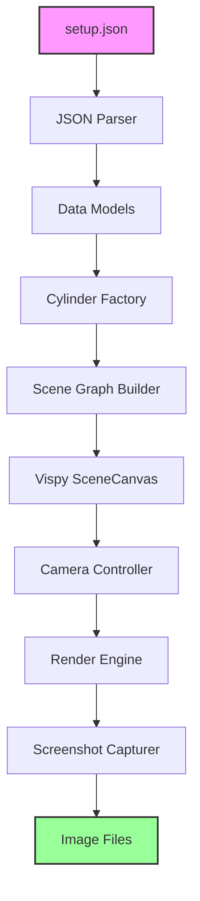
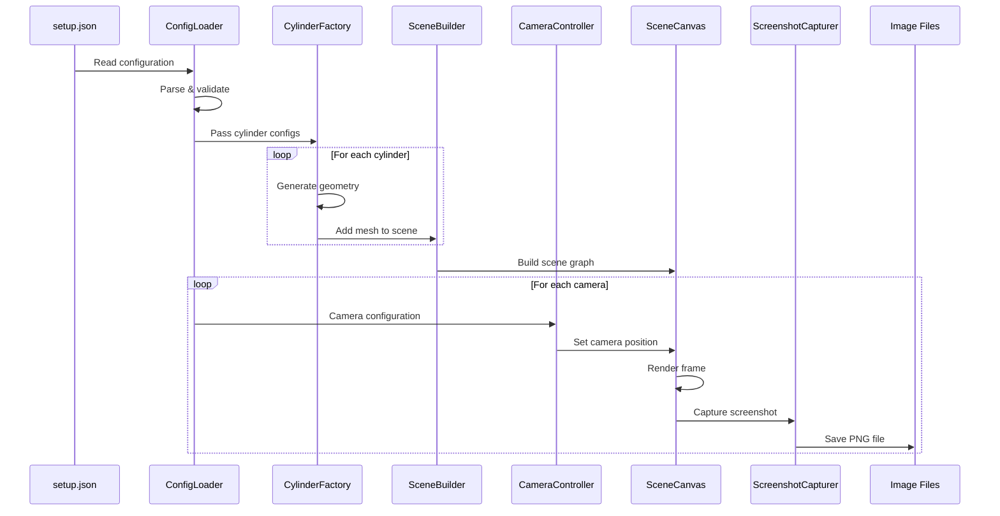

# Vispy 3D Rendering Architecture

## Executive Summary

This document outlines the architecture for a Python-based 3D rendering solution using Vispy that reads robot arm configuration from a JSON file and generates screenshots from multiple camera angles. Vispy provides high-performance GPU-accelerated rendering through OpenGL, offering an elegant scene graph API that simplifies 3D visualization while maintaining excellent performance.

## System Overview



## Core Components

### 1. Configuration Loader
**Purpose:** Parse and validate the setup.json file containing camera and cylinder definitions.

**Responsibilities:**
- Read JSON configuration from disk
- Validate structure and data types
- Convert to Python data structures
- Handle errors gracefully with descriptive messages

**Key Classes:**
```python
class ConfigurationLoader:
    def load_config(self, filepath: str) -> SceneConfiguration
    def validate_schema(self, data: dict) -> bool
    def parse_cameras(self, camera_data: list) -> List[CameraConfig]
    def parse_cylinders(self, cylinder_data: list) -> List[CylinderConfig]
```

### 2. Data Models

#### SceneConfiguration
```python
from dataclasses import dataclass
from typing import List, Tuple

@dataclass
class SceneConfiguration:
    cameras: List[CameraConfig]
    cylinders: List[CylinderConfig]

@dataclass
class CameraConfig:
    id: int
    name: str
    position: Tuple[float, float, float]
    look_at: Tuple[float, float, float]

@dataclass
class CylinderConfig:
    name: str
    radius: float
    color: str
    start_point: Tuple[float, float, float]
    end_point: Tuple[float, float, float]
```

### 3. Cylinder Mesh Factory
**Purpose:** Create cylinder meshes using Vispy's geometry generation capabilities.

**Responsibilities:**
- Generate cylinder geometry from start/end points
- Calculate proper transformations
- Apply colors and materials
- Optimize mesh data for GPU rendering

**Implementation Approach:**
```python
class CylinderMeshFactory:
    def create_cylinder_mesh(self, config: CylinderConfig):
        """
        Create a cylinder mesh using Vispy's MeshVisual
        Since Vispy doesn't have a built-in cylinder, we'll:
        1. Generate cylinder vertices and faces
        2. Create a MeshVisual with the geometry
        3. Apply transformations to position correctly
        """
        vertices, faces = self.generate_cylinder_geometry(
            config.start_point,
            config.end_point,
            config.radius
        )
        colors = self.get_color_array(config.color, len(vertices))
        return vertices, faces, colors
    
    def generate_cylinder_geometry(self, start, end, radius, segments=32):
        """Generate vertices and faces for a cylinder"""
        # Calculate cylinder axis and height
        # Generate circular vertices at both ends
        # Create triangular faces connecting the vertices
        pass
```

### 4. Scene Graph Builder
**Purpose:** Construct Vispy's scene graph hierarchy for efficient rendering.

**Responsibilities:**
- Initialize SceneCanvas with proper configuration
- Create ViewBox for 3D scene management
- Add cylinder meshes to scene
- Configure lighting and rendering properties

**Scene Graph Structure:**
```
SceneCanvas
└── ViewBox
    ├── Lighting System
    ├── Cylinder Meshes
    │   ├── Baseplate Mesh
    │   ├── Joint Meshes
    │   ├── Arm Meshes
    │   └── Gripper Meshes
    └── Axis Helper (optional)
```

**Implementation:**
```python
from vispy import scene
from vispy.scene import SceneCanvas, ViewBox, visuals

class SceneGraphBuilder:
    def __init__(self):
        self.canvas = SceneCanvas(
            keys='interactive',
            bgcolor='white',
            show=False,  # Off-screen rendering
            size=(1920, 1080)
        )
        self.view = self.canvas.central_widget.add_view()
        self.setup_lighting()
    
    def add_cylinder(self, vertices, faces, colors):
        mesh = visuals.Mesh(
            vertices=vertices,
            faces=faces,
            vertex_colors=colors,
            shading='smooth'
        )
        self.view.add(mesh)
        return mesh
    
    def setup_lighting(self):
        # Configure ambient and directional lighting
        self.view.camera = scene.TurntableCamera(
            elevation=30,
            azimuth=30,
            fov=60
        )
```

### 5. Cylinder Visual Alternative (Using TubeVisual)
**Purpose:** Alternative implementation using Vispy's TubeVisual for smoother cylinders.

**Advantages:**
- Built-in support for tube/cylinder shapes
- Automatic smooth interpolation
- Simplified API

**Implementation:**
```python
from vispy.scene import visuals

class CylinderVisualFactory:
    def create_cylinder_visual(self, config: CylinderConfig):
        # Create points along cylinder axis
        points = np.array([
            config.start_point,
            config.end_point
        ])
        
        # Create TubeVisual
        tube = visuals.Tube(
            points=points,
            radius=config.radius,
            color=self.parse_color(config.color),
            tube_points=32,  # Resolution
            shading='smooth'
        )
        return tube
```

### 6. Camera Controller
**Purpose:** Manage camera positioning for multiple viewpoints.

**Responsibilities:**
- Set camera position and orientation
- Configure field of view
- Handle view matrix calculations
- Reset camera between shots

**Implementation:**
```python
class CameraController:
    def setup_camera(self, view: ViewBox, config: CameraConfig):
        # Create custom camera with specific position
        camera = scene.cameras.TurntableCamera(
            fov=60,
            distance=None  # Manual positioning
        )
        
        # Set position and look-at
        self.position_camera(camera, config)
        view.camera = camera
    
    def position_camera(self, camera, config):
        # Calculate view matrix from position and look-at
        eye = np.array(config.position)
        center = np.array(config.look_at)
        up = self.calculate_up_vector(eye, center)
        
        camera.view_matrix = self.look_at_matrix(eye, center, up)
    
    def look_at_matrix(self, eye, center, up):
        """Create view matrix using look-at algorithm"""
        # Implementation of look-at matrix calculation
        pass
```

### 7. Render Engine
**Purpose:** Manage the rendering pipeline and frame buffer operations.

**Responsibilities:**
- Configure OpenGL rendering settings
- Handle render passes
- Manage frame buffer objects
- Optimize rendering performance

**Key Features:**
- Anti-aliasing support
- Depth testing
- Back-face culling
- Multi-sampling

### 8. Screenshot Capturer
**Purpose:** Capture rendered frames and save as image files.

**Responsibilities:**
- Read pixels from frame buffer
- Convert to image format
- Save with appropriate naming
- Handle file I/O operations

**Implementation:**
```python
import numpy as np
from vispy import io

class ScreenshotCapturer:
    def capture(self, canvas: SceneCanvas, camera_name: str, output_dir: str):
        # Render the scene
        canvas.update()
        canvas.app.process_events()
        
        # Capture the rendered image
        image = canvas.render()
        
        # Save to file
        filename = f"{output_dir}/{camera_name}_view.png"
        io.write_png(filename, image)
        
        return filename
```

## Color Management

### Color Mapping System
```python
class ColorManager:
    COLOR_MAP = {
        'orange': '#FFA500',
        'yellow': '#FFFF00',
        'blue': '#0000FF',
        'green': '#00FF00',
        'red': '#FF0000',
        'purple': '#800080',
        'cyan': '#00FFFF',
        'magenta': '#FF00FF'
    }
    
    def parse_color(self, color_name: str):
        """Convert color name to RGBA array"""
        from vispy.color import Color
        hex_color = self.COLOR_MAP.get(color_name, '#808080')
        return Color(hex_color).rgba
```

## Data Flow



## Technical Stack

### Core Dependencies
- **Vispy** (>=0.14.0): High-performance interactive 2D/3D visualization
- **NumPy** (>=1.20.0): Numerical operations and array handling
- **PyOpenGL**: OpenGL bindings (installed with Vispy)
- **Python** (>=3.8): Core language runtime

### Optional Dependencies
- **PyQt5/PyQt6/PySide2/PySide6**: GUI backend (for development/debugging)
- **Pillow**: Advanced image processing
- **imageio**: Alternative image I/O

### Backend Options
Vispy supports multiple backends:
- **EGL**: Headless rendering (recommended for servers)
- **GLFW**: Lightweight windowing
- **SDL2**: Cross-platform multimedia
- **Qt**: Full-featured GUI framework

## Implementation Strategy

### Phase 1: Foundation (Day 1)
1. Set up project structure and dependencies
2. Implement data models and configuration loader
3. Create basic Vispy scene canvas
4. Test JSON parsing and validation

### Phase 2: Geometry Generation (Day 2)
1. Implement cylinder mesh generation
2. Create transformation calculations
3. Apply colors and materials
4. Test with simple cylinders

### Phase 3: Scene Construction (Day 3)
1. Build scene graph hierarchy
2. Add all cylinder meshes
3. Configure lighting system
4. Implement view management

### Phase 4: Camera System (Day 4)
1. Implement camera positioning logic
2. Create look-at calculations
3. Handle multiple camera configurations
4. Test camera switching

### Phase 5: Screenshot Generation (Day 5)
1. Implement off-screen rendering
2. Create screenshot capture logic
3. Add file naming conventions
4. Test output quality

### Phase 6: Optimization & Polish (Day 6)
1. Performance optimization
2. Error handling improvements
3. Add logging system
4. Create comprehensive tests

## File Structure

```
visualizer-try-2/
├── setup.json                  # Input configuration
├── vispy-architecture.md       # This document
├── main.py                     # Entry point
├── requirements.txt            # Dependencies
├── src/
│   ├── __init__.py
│   ├── config/
│   │   ├── __init__.py
│   │   ├── loader.py          # JSON parsing
│   │   └── models.py          # Data classes
│   ├── geometry/
│   │   ├── __init__.py
│   │   ├── cylinder_factory.py # Cylinder mesh generation
│   │   └── transforms.py      # Transformation utilities
│   ├── scene/
│   │   ├── __init__.py
│   │   ├── scene_builder.py   # Scene graph construction
│   │   ├── camera_controller.py # Camera management
│   │   └── lighting.py        # Lighting configuration
│   ├── rendering/
│   │   ├── __init__.py
│   │   ├── renderer.py        # Render engine
│   │   └── screenshot.py      # Screenshot capture
│   ├── utils/
│   │   ├── __init__.py
│   │   ├── colors.py          # Color utilities
│   │   └── validators.py      # Input validation
│   └── visuals/
│       ├── __init__.py
│       └── cylinder_visual.py # Custom cylinder visual
├── screenshots/                # Output directory
│   ├── top_camera_view.png
│   ├── front_camera_view.png
│   └── side_camera_view.png
└── tests/
    ├── __init__.py
    ├── test_config_loader.py
    ├── test_cylinder_factory.py
    ├── test_camera_controller.py
    └── test_integration.py
```

## Key Algorithms

### Cylinder Geometry Generation
```python
def generate_cylinder_geometry(start_point, end_point, radius, segments=32):
    """Generate vertices and faces for a cylinder mesh"""
    import numpy as np
    
    start = np.array(start_point)
    end = np.array(end_point)
    
    # Calculate cylinder axis
    axis = end - start
    height = np.linalg.norm(axis)
    axis_normalized = axis / height
    
    # Find perpendicular vectors
    if abs(axis_normalized[2]) < 0.9:
        perp1 = np.cross(axis_normalized, [0, 0, 1])
    else:
        perp1 = np.cross(axis_normalized, [1, 0, 0])
    perp1 = perp1 / np.linalg.norm(perp1)
    perp2 = np.cross(axis_normalized, perp1)
    
    # Generate vertices
    vertices = []
    for i in range(2):  # Top and bottom
        center = start if i == 0 else end
        for j in range(segments):
            angle = 2 * np.pi * j / segments
            offset = radius * (np.cos(angle) * perp1 + np.sin(angle) * perp2)
            vertices.append(center + offset)
    
    vertices = np.array(vertices, dtype=np.float32)
    
    # Generate faces
    faces = []
    # Side faces
    for i in range(segments):
        next_i = (i + 1) % segments
        # Triangle 1
        faces.append([i, next_i, i + segments])
        # Triangle 2
        faces.append([next_i, next_i + segments, i + segments])
    
    # Cap faces (optional)
    # Add center vertices for caps
    vertices = np.vstack([vertices, start, end])
    bottom_center_idx = len(vertices) - 2
    top_center_idx = len(vertices) - 1
    
    for i in range(segments):
        next_i = (i + 1) % segments
        # Bottom cap
        faces.append([bottom_center_idx, next_i, i])
        # Top cap
        faces.append([top_center_idx, i + segments, next_i + segments])
    
    return vertices, np.array(faces, dtype=np.uint32)
```

### Camera Look-At Matrix
```python
def look_at_matrix(eye, center, up):
    """Create a view matrix using the look-at algorithm"""
    import numpy as np
    
    eye = np.array(eye)
    center = np.array(center)
    up = np.array(up)
    
    # Calculate viewing direction
    f = center - eye
    f = f / np.linalg.norm(f)
    
    # Calculate right vector
    s = np.cross(f, up)
    s = s / np.linalg.norm(s)
    
    # Recalculate up vector
    u = np.cross(s, f)
    
    # Create view matrix
    matrix = np.eye(4)
    matrix[0, :3] = s
    matrix[1, :3] = u
    matrix[2, :3] = -f
    matrix[:3, 3] = -np.dot(matrix[:3, :3], eye)
    
    return matrix
```

## Performance Optimization

### GPU Optimization
1. **Vertex Buffer Objects (VBO)**: Vispy automatically uses VBOs for efficient GPU memory usage
2. **Instanced Rendering**: For multiple similar cylinders, use instancing
3. **Level of Detail**: Adjust cylinder segments based on distance
4. **Culling**: Enable back-face culling for closed cylinders

### Memory Optimization
```python
class ResourcePool:
    """Pool resources to avoid repeated allocations"""
    def __init__(self):
        self.mesh_cache = {}
        self.color_cache = {}
    
    def get_cylinder_mesh(self, key, generator_func):
        if key not in self.mesh_cache:
            self.mesh_cache[key] = generator_func()
        return self.mesh_cache[key]
    
    def clear(self):
        self.mesh_cache.clear()
        self.color_cache.clear()
```

### Rendering Pipeline Optimization
1. **Batch Processing**: Combine multiple cylinders into single mesh when possible
2. **Off-screen Rendering**: Use framebuffer objects for headless operation
3. **Multi-threading**: Separate geometry generation from rendering
4. **Caching**: Cache transformed vertices for static scenes

## Error Handling

### Critical Errors (Program Termination)
```python
class CriticalError(Exception):
    """Errors that require program termination"""
    pass

# Examples:
# - Missing or corrupt setup.json
# - OpenGL context creation failure
# - Invalid Vispy installation
```

### Recoverable Errors (Warning & Continue)
```python
class RecoverableError(Warning):
    """Errors that allow continuation with defaults"""
    pass

# Examples:
# - Unknown color name (use default gray)
# - Invalid cylinder dimensions (skip cylinder)
# - Screenshot save failure (retry or skip)
```

### Validation Rules
```python
class Validator:
    @staticmethod
    def validate_cylinder(config: CylinderConfig):
        # Radius must be positive
        assert config.radius > 0, "Cylinder radius must be positive"
        
        # Start and end points must differ
        start = np.array(config.start_point)
        end = np.array(config.end_point)
        assert np.linalg.norm(end - start) > 1e-6, "Cylinder endpoints must differ"
        
        # Color must be valid
        assert config.color in ColorManager.COLOR_MAP, f"Unknown color: {config.color}"
```

## Testing Strategy

### Unit Tests
```python
# test_cylinder_factory.py
def test_cylinder_geometry():
    factory = CylinderMeshFactory()
    vertices, faces, colors = factory.create_cylinder_mesh(
        CylinderConfig(
            name="test",
            radius=5.0,
            color="blue",
            start_point=(0, 0, 0),
            end_point=(0, 10, 0)
        )
    )
    
    assert len(vertices) > 0
    assert len(faces) > 0
    assert colors.shape[1] == 4  # RGBA
```

### Integration Tests
```python
# test_integration.py
def test_full_pipeline():
    # Load configuration
    config = ConfigurationLoader().load_config("test_setup.json")
    
    # Build scene
    builder = SceneGraphBuilder()
    factory = CylinderMeshFactory()
    
    for cylinder in config.cylinders:
        mesh_data = factory.create_cylinder_mesh(cylinder)
        builder.add_cylinder(*mesh_data)
    
    # Generate screenshots
    capturer = ScreenshotCapturer()
    for camera in config.cameras:
        # Position camera and capture
        pass
```

### Visual Tests
- Manual inspection of generated screenshots
- Automated image comparison with reference images
- Color accuracy verification
- Geometry validation

## Advanced Features

### Animation Support
```python
class AnimationController:
    def __init__(self, scene_canvas):
        self.canvas = scene_canvas
        self.timer = scene_canvas.timer
        self.frame = 0
    
    def animate_camera_orbit(self, center, radius, duration):
        """Animate camera orbiting around a point"""
        def update(event):
            angle = (self.frame / duration) * 2 * np.pi
            x = center[0] + radius * np.cos(angle)
            y = center[1] + radius * np.sin(angle)
            z = center[2]
            # Update camera position
            self.frame += 1
        
        self.timer.connect(update)
        self.timer.start(1/60)  # 60 FPS
```

### Interactive Mode
```python
def enable_interactive_mode(canvas):
    """Enable interactive camera controls"""
    canvas.show = True  # Show window
    canvas.view.camera = scene.TurntableCamera(
        elevation=30,
        azimuth=30,
        fov=60,
        distance=100
    )
    # Mouse and keyboard controls are automatically enabled
```

## Comparison with Other Solutions

### Vispy vs PyVista
| Feature | Vispy | PyVista |
|---------|-------|---------|
| Performance | Excellent (direct OpenGL) | Good (VTK-based) |
| API Complexity | Moderate | Simple |
| Customization | High | Moderate |
| Memory Usage | Low | Higher |
| Scene Graph | Native support | Limited |
| Dependencies | Minimal | Heavy (VTK) |

### Vispy vs VTK
| Feature | Vispy | VTK |
|---------|-------|-----|
| Learning Curve | Moderate | Steep |
| Performance | Excellent | Excellent |
| Documentation | Good | Extensive |
| Community | Growing | Large |
| Use Case | Visualization | Scientific/Medical |

## Troubleshooting Guide

### Common Issues and Solutions

| Issue | Cause | Solution |
|-------|-------|----------|
| Black screenshots | No OpenGL context | Use EGL backend for headless |
| Missing cylinders | Transform errors | Check coordinate calculations |
| Poor performance | Too many draw calls | Batch geometry into single mesh |
| Color issues | Color space mismatch | Ensure RGBA format [0-1] range |
| Memory leaks | Resources not released | Call canvas.close() after use |

### Debug Mode
```python
def enable_debug_mode():
    import vispy
    vispy.use(log_level='debug')
    
    # Enable OpenGL debugging
    from vispy import gloo
    gloo.gl.use_gl('gl+')
    
    # Print system info
    print(vispy.sys_info())
```

## Security Considerations

1. **Input Validation**: Sanitize all JSON inputs
2. **Resource Limits**: Cap maximum cylinders and cameras
3. **File System Access**: Restrict write operations to designated directories
4. **Memory Limits**: Monitor and limit memory usage

```python
class SecurityManager:
    MAX_CYLINDERS = 1000
    MAX_CAMERAS = 50
    MAX_IMAGE_SIZE = (4096, 4096)
    ALLOWED_OUTPUT_DIR = './screenshots'
    
    @classmethod
    def validate_limits(cls, config):
        assert len(config.cylinders) <= cls.MAX_CYLINDERS
        assert len(config.cameras) <= cls.MAX_CAMERAS
```

## Performance Benchmarks

### Expected Performance Metrics
| Operation | Target Time | Maximum Time |
|-----------|------------|--------------|
| JSON Parsing | < 10ms | 50ms |
| Cylinder Generation (per cylinder) | < 5ms | 20ms |
| Scene Building | < 100ms | 300ms |
| Single Screenshot | < 150ms | 400ms |
| Total (3 cameras, 8 cylinders) | < 800ms | 1500ms |

### Optimization Techniques
1. **Geometry Caching**: Reuse cylinder meshes with same dimensions
2. **Parallel Processing**: Use multiprocessing for multiple cameras
3. **GPU Instancing**: Render similar cylinders in single draw call
4. **Resolution Scaling**: Adjust output resolution based on requirements

## Future Enhancements

### Planned Features
1. **Real-time Visualization**: Interactive 3D viewer with controls
2. **Animation Export**: Generate video sequences
3. **Advanced Materials**: PBR shading, textures, transparency
4. **Scene Presets**: Predefined lighting and camera setups
5. **Batch Processing**: Handle multiple JSON configurations
6. **Web Deployment**: WebGL export for browser viewing

### Extensibility Points
```python
class VisualPlugin:
    """Base class for extending visualization capabilities"""
    def on_scene_built(self, scene): pass
    def on_render(self, canvas): pass
    def on_screenshot(self, image): pass

# Example: Add coordinate axes
class AxisPlugin(VisualPlugin):
    def on_scene_built(self, scene):
        axis = visuals.XYZAxis(parent=scene.view)
```

## Conclusion

This Vispy-based architecture provides a modern, high-performance solution for 3D rendering of robot arm configurations. Key advantages include:

- **Performance**: Direct OpenGL access ensures maximum GPU utilization
- **Flexibility**: Scene graph architecture allows complex visualizations
- **Simplicity**: Clean API design reduces implementation complexity
- **Portability**: Cross-platform support with minimal dependencies
- **Scalability**: Efficient handling of large numbers of cylinders

The modular design ensures maintainability while the comprehensive error handling and testing strategy guarantee reliability. Vispy's active development and growing community make it an excellent choice for scientific visualization applications.

## References

- [Vispy Documentation](https://vispy.org/)
- [Vispy GitHub Repository](https://github.com/vispy/vispy)
- [OpenGL Programming Guide](https://www.opengl.org/documentation/)
- [Scientific Visualization Best Practices](https://www.scivis.org/)

---

*Document Version: 1.0*  
*Last Updated: 2024*  
*Author: System Architect*