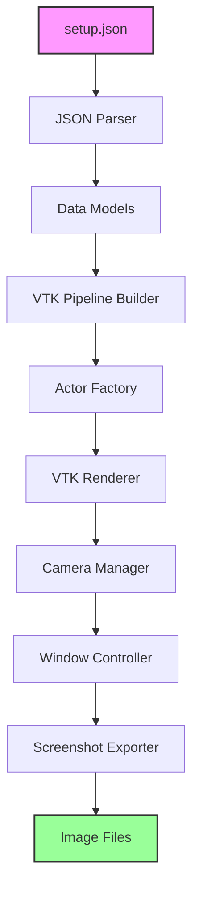
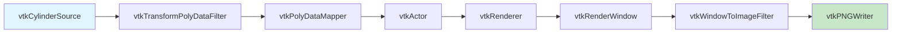
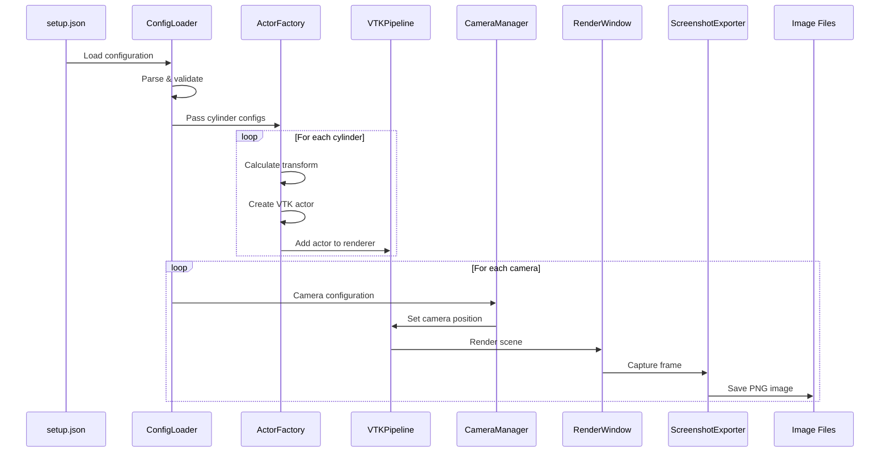

# VTK 3D Rendering Architecture

## Executive Summary

This document outlines the architecture for a Python-based 3D rendering solution using VTK (Visualization Toolkit) that reads robot arm configuration from a JSON file and generates screenshots from multiple camera angles. The system visualizes cylinder primitives representing robot arm components with specified colors and dimensions using VTK's powerful low-level rendering capabilities.

## System Overview



## Core Components

### 1. Configuration Loader
**Purpose:** Parse and validate the setup.json file containing camera and cylinder definitions.

**Responsibilities:**
- Read JSON file from disk using Python's json module
- Validate JSON structure and data types
- Convert JSON data to strongly-typed Python objects
- Handle parsing errors with descriptive error messages

**Key Classes:**
```python
class ConfigurationLoader:
    def load_config(self, filepath: str) -> SceneConfiguration
    def validate_schema(self, data: dict) -> bool
    def parse_cameras(self, camera_data: list) -> List[CameraConfig]
    def parse_cylinders(self, cylinder_data: list) -> List[CylinderConfig]
```

### 2. Data Models

#### SceneConfiguration
```python
@dataclass
class SceneConfiguration:
    cameras: List[CameraConfig]
    cylinders: List[CylinderConfig]
    
@dataclass
class CameraConfig:
    id: int
    name: str
    position: Tuple[float, float, float]
    look_at: Tuple[float, float, float]
    
@dataclass
class CylinderConfig:
    name: str
    radius: float
    color: str
    start_point: Tuple[float, float, float]
    end_point: Tuple[float, float, float]
```

### 3. VTK Pipeline Builder
**Purpose:** Construct the VTK rendering pipeline with proper source, mapper, and actor connections.

**Responsibilities:**
- Initialize VTK rendering pipeline
- Create and configure vtkRenderer
- Set up vtkRenderWindow for off-screen rendering
- Configure rendering properties (anti-aliasing, lighting)

**Key VTK Classes Used:**
- `vtkRenderer`: Manages the rendering process
- `vtkRenderWindow`: Window for rendering (off-screen capable)
- `vtkRenderWindowInteractor`: Handles interaction (disabled for batch)
- `vtkLight`: Lighting configuration

**Implementation:**
```python
class VTKPipelineBuilder:
    def __init__(self):
        self.renderer = vtk.vtkRenderer()
        self.render_window = vtk.vtkRenderWindow()
        self.setup_pipeline()
    
    def setup_pipeline(self):
        self.render_window.SetOffScreenRendering(1)
        self.render_window.AddRenderer(self.renderer)
        self.configure_lighting()
        self.set_background()
```

### 4. Cylinder Actor Factory
**Purpose:** Create VTK cylinder actors from configuration data with proper transformations.

**Responsibilities:**
- Calculate cylinder orientation from start/end points
- Create vtkCylinderSource with correct dimensions
- Apply transformations using vtkTransform
- Map colors to VTK color specifications
- Create complete actor pipeline (source → mapper → actor)

**Key VTK Components:**
```python
class CylinderActorFactory:
    def create_cylinder_actor(self, config: CylinderConfig) -> vtk.vtkActor:
        # Create cylinder source
        cylinder_source = vtk.vtkCylinderSource()
        cylinder_source.SetRadius(config.radius)
        cylinder_source.SetHeight(self.calculate_height(config))
        cylinder_source.SetResolution(32)
        
        # Create transformation
        transform = self.calculate_transform(config)
        transform_filter = vtk.vtkTransformPolyDataFilter()
        transform_filter.SetTransform(transform)
        transform_filter.SetInputConnection(cylinder_source.GetOutputPort())
        
        # Create mapper
        mapper = vtk.vtkPolyDataMapper()
        mapper.SetInputConnection(transform_filter.GetOutputPort())
        
        # Create actor
        actor = vtk.vtkActor()
        actor.SetMapper(mapper)
        self.apply_color(actor, config.color)
        
        return actor
```

### 5. Transform Calculator
**Purpose:** Calculate proper 3D transformations for cylinder positioning and orientation.

**Mathematical Operations:**
- Calculate cylinder center point
- Compute height from start/end points
- Determine rotation matrix for cylinder orientation
- Apply translation to correct position

**Algorithm:**
```python
def calculate_transform(self, config: CylinderConfig) -> vtk.vtkTransform:
    start = np.array(config.start_point)
    end = np.array(config.end_point)
    
    # Calculate center
    center = (start + end) / 2.0
    
    # Calculate direction vector
    direction = end - start
    length = np.linalg.norm(direction)
    direction_normalized = direction / length
    
    # Default cylinder axis is Y-axis (0, 1, 0)
    default_axis = np.array([0, 1, 0])
    
    # Calculate rotation axis and angle
    rotation_axis = np.cross(default_axis, direction_normalized)
    angle = np.arccos(np.dot(default_axis, direction_normalized))
    
    # Create VTK transform
    transform = vtk.vtkTransform()
    transform.Translate(center)
    if np.linalg.norm(rotation_axis) > 0:
        transform.RotateWXYZ(np.degrees(angle), rotation_axis)
    
    return transform
```

### 6. Color Manager
**Purpose:** Convert color names to VTK RGB values and manage color properties.

**Color Mapping Table:**
| Color Name | RGB Values | VTK Format |
|------------|------------|------------|
| orange | (1.0, 0.647, 0.0) | SetColor(1.0, 0.647, 0.0) |
| yellow | (1.0, 1.0, 0.0) | SetColor(1.0, 1.0, 0.0) |
| blue | (0.0, 0.0, 1.0) | SetColor(0.0, 0.0, 1.0) |
| green | (0.0, 1.0, 0.0) | SetColor(0.0, 1.0, 0.0) |

**Implementation:**
```python
class ColorManager:
    COLOR_MAP = {
        'orange': (1.0, 0.647, 0.0),
        'yellow': (1.0, 1.0, 0.0),
        'blue': (0.0, 0.0, 1.0),
        'green': (0.0, 1.0, 0.0),
        # Add more colors as needed
    }
    
    def apply_color(self, actor: vtk.vtkActor, color_name: str):
        rgb = self.COLOR_MAP.get(color_name, (0.5, 0.5, 0.5))
        actor.GetProperty().SetColor(rgb)
        actor.GetProperty().SetSpecular(0.3)
        actor.GetProperty().SetSpecularPower(20)
```

### 7. Camera Manager
**Purpose:** Configure VTK camera for each defined view position.

**Responsibilities:**
- Set camera position using vtkCamera
- Configure focal point (look-at)
- Calculate and set view up vector
- Handle camera reset between views
- Configure field of view and clipping planes

**VTK Camera Setup:**
```python
class CameraManager:
    def setup_camera(self, renderer: vtk.vtkRenderer, config: CameraConfig):
        camera = renderer.GetActiveCamera()
        
        # Set position and focal point
        camera.SetPosition(config.position)
        camera.SetFocalPoint(config.look_at)
        
        # Calculate appropriate up vector
        up_vector = self.calculate_up_vector(config)
        camera.SetViewUp(up_vector)
        
        # Configure view angle and clipping
        camera.SetViewAngle(30)
        renderer.ResetCameraClippingRange()
```

### 8. Render Window Controller
**Purpose:** Manage the VTK render window for off-screen rendering.

**Responsibilities:**
- Configure window size and resolution
- Enable/disable off-screen rendering
- Manage render window state
- Handle window updates

**Configuration:**
```python
class RenderWindowController:
    def __init__(self, width=1920, height=1080):
        self.render_window = vtk.vtkRenderWindow()
        self.render_window.SetSize(width, height)
        self.render_window.SetOffScreenRendering(1)
        self.render_window.SetMultiSamples(4)  # Anti-aliasing
```

### 9. Screenshot Exporter
**Purpose:** Capture rendered frames and save as image files.

**Responsibilities:**
- Capture frame buffer using vtkWindowToImageFilter
- Convert to appropriate image format
- Save images with proper naming convention
- Handle directory creation

**VTK Screenshot Pipeline:**
```python
class ScreenshotExporter:
    def capture_screenshot(self, render_window: vtk.vtkRenderWindow, 
                          camera_name: str, output_dir: str):
        # Create window to image filter
        window_to_image = vtk.vtkWindowToImageFilter()
        window_to_image.SetInput(render_window)
        window_to_image.SetScale(1)
        window_to_image.SetInputBufferTypeToRGBA()
        window_to_image.Update()
        
        # Write to file
        writer = vtk.vtkPNGWriter()
        writer.SetFileName(f"{output_dir}/{camera_name}_view.png")
        writer.SetInputConnection(window_to_image.GetOutputPort())
        writer.Write()
```

## VTK Rendering Pipeline



## Data Flow Sequence



## Implementation Strategy

### Phase 1: Core Infrastructure
1. **Setup Project Structure**
   - Create directory hierarchy
   - Initialize Python package structure
   - Set up virtual environment

2. **Install Dependencies**
   ```bash
   pip install vtk numpy pillow
   ```

3. **Implement Data Models**
   - Create dataclasses for configuration
   - Implement validation logic

### Phase 2: VTK Foundation
1. **Create VTK Pipeline Builder**
   - Initialize renderer and render window
   - Configure off-screen rendering
   - Set up basic lighting

2. **Implement Transform Calculator**
   - Vector mathematics for cylinder orientation
   - Transform matrix generation

### Phase 3: Geometry Creation
1. **Build Cylinder Actor Factory**
   - Create cylinder sources
   - Apply transformations
   - Configure materials and colors

2. **Implement Color Manager**
   - Color name to RGB mapping
   - Material property configuration

### Phase 4: Camera System
1. **Develop Camera Manager**
   - Camera positioning logic
   - View up vector calculation
   - Field of view configuration

2. **Test Multiple Views**
   - Verify camera switching
   - Validate view parameters

### Phase 5: Output Generation
1. **Create Screenshot Exporter**
   - Frame buffer capture
   - Image format conversion
   - File naming and saving

2. **Directory Management**
   - Create output directories
   - Handle file overwrites

### Phase 6: Integration & Testing
1. **Build Main Application**
   - Command-line interface
   - Error handling
   - Progress reporting

2. **Comprehensive Testing**
   - Unit tests for components
   - Integration tests
   - Visual verification

## File Structure

```
visualizer-try-2/
├── setup.json                  # Input configuration
├── vtk-architecture.md         # This document
├── main.py                     # Application entry point
├── requirements.txt            # Python dependencies
├── src/
│   ├── __init__.py
│   ├── config/
│   │   ├── __init__.py
│   │   ├── loader.py          # JSON configuration loader
│   │   └── models.py          # Data model definitions
│   ├── vtk_core/
│   │   ├── __init__.py
│   │   ├── pipeline.py        # VTK pipeline builder
│   │   ├── actor_factory.py   # Cylinder actor creation
│   │   └── transform.py       # Transform calculations
│   ├── rendering/
│   │   ├── __init__.py
│   │   ├── camera_manager.py  # Camera configuration
│   │   ├── color_manager.py   # Color mapping
│   │   └── window_controller.py # Render window management
│   ├── export/
│   │   ├── __init__.py
│   │   └── screenshot.py      # Screenshot capture & export
│   └── utils/
│       ├── __init__.py
│       ├── validators.py      # Input validation
│       └── math_utils.py      # Vector math utilities
├── screenshots/                # Output directory
│   ├── top_camera_view.png
│   ├── front_camera_view.png
│   └── side_camera_view.png
└── tests/
    ├── __init__.py
    ├── test_config_loader.py
    ├── test_actor_factory.py
    ├── test_transform.py
    ├── test_camera_manager.py
    └── test_integration.py
```

## Key Algorithms and Code Examples

### Main Application Flow
```python
def main():
    # Load configuration
    config_loader = ConfigurationLoader()
    scene_config = config_loader.load_config("setup.json")
    
    # Build VTK pipeline
    pipeline = VTKPipelineBuilder()
    renderer = pipeline.get_renderer()
    render_window = pipeline.get_render_window()
    
    # Create cylinder actors
    actor_factory = CylinderActorFactory()
    for cylinder_config in scene_config.cylinders:
        actor = actor_factory.create_cylinder_actor(cylinder_config)
        renderer.AddActor(actor)
    
    # Setup camera manager and screenshot exporter
    camera_manager = CameraManager()
    screenshot_exporter = ScreenshotExporter()
    
    # Generate screenshots for each camera
    for camera_config in scene_config.cameras:
        camera_manager.setup_camera(renderer, camera_config)
        render_window.Render()
        screenshot_exporter.capture_screenshot(
            render_window, 
            camera_config.name,
            "screenshots"
        )
    
    print("Screenshots generated successfully!")
```

### Cylinder Transform Calculation
```python
def calculate_cylinder_transform(start_point, end_point):
    """
    Calculate transformation matrix for cylinder placement
    VTK cylinders are created along Y-axis by default
    """
    import numpy as np
    import vtk
    
    start = np.array(start_point)
    end = np.array(end_point)
    
    # Calculate center and height
    center = (start + end) / 2.0
    height = np.linalg.norm(end - start)
    
    # Calculate rotation
    direction = (end - start) / height
    y_axis = np.array([0, 1, 0])
    
    # Cross product for rotation axis
    rotation_axis = np.cross(y_axis, direction)
    rotation_angle = np.arccos(np.clip(np.dot(y_axis, direction), -1, 1))
    
    # Create VTK transform
    transform = vtk.vtkTransform()
    transform.Translate(center)
    
    if np.linalg.norm(rotation_axis) > 1e-6:
        transform.RotateWXYZ(
            np.degrees(rotation_angle),
            rotation_axis[0],
            rotation_axis[1],
            rotation_axis[2]
        )
    
    return transform, height
```

## Performance Optimization

### Rendering Optimizations
1. **Off-screen Rendering**
   - Eliminates GUI overhead
   - Enables batch processing
   - Reduces memory footprint

2. **Actor Caching**
   - Create actors once, reuse for multiple views
   - Minimize geometry recalculation

3. **Level of Detail (LOD)**
   - Adjust cylinder resolution based on distance
   - Use vtkLODProp3D for automatic LOD switching

### Memory Management
```python
class ResourceManager:
    def __init__(self):
        self.actors = []
        self.sources = []
    
    def cleanup(self):
        """Release VTK resources"""
        for actor in self.actors:
            actor.ReleaseGraphicsResources(None)
        self.actors.clear()
        self.sources.clear()
```

## Error Handling Strategy

### Error Categories

#### Critical Errors (Terminate)
- Missing setup.json file
- Invalid JSON syntax
- VTK initialization failure
- File write permissions denied

#### Recoverable Errors (Log & Continue)
- Unknown color name (use default)
- Invalid cylinder dimensions (skip)
- Camera configuration issues (use defaults)

### Error Handler Implementation
```python
class VTKErrorHandler:
    @staticmethod
    def handle_critical(error: Exception):
        """Handle critical errors that require termination"""
        logging.error(f"Critical error: {error}")
        sys.exit(1)
    
    @staticmethod
    def handle_recoverable(error: Exception, context: str):
        """Handle recoverable errors with fallback"""
        logging.warning(f"Recoverable error in {context}: {error}")
        return None  # Or return default value
```

## Testing Strategy

### Unit Tests
```python
# test_actor_factory.py
def test_cylinder_creation():
    config = CylinderConfig(
        name="test_cylinder",
        radius=5.0,
        color="blue",
        start_point=(0, 0, 0),
        end_point=(0, 10, 0)
    )
    
    factory = CylinderActorFactory()
    actor = factory.create_cylinder_actor(config)
    
    assert actor is not None
    assert actor.GetMapper() is not None
    # Verify color
    color = actor.GetProperty().GetColor()
    assert color == (0.0, 0.0, 1.0)
```

### Integration Tests
- End-to-end rendering pipeline
- Multiple camera views
- Screenshot generation verification

### Performance Benchmarks
| Operation | Expected Time | Max Time |
|-----------|--------------|----------|
| JSON Load | < 10ms | 50ms |
| Per Cylinder | < 5ms | 20ms |
| Per Screenshot | < 200ms | 500ms |
| Total (3 cameras, 8 cylinders) | < 1s | 2s |

## Dependencies

### Required Python Packages
```txt
# requirements.txt
vtk>=9.2.0          # VTK library
numpy>=1.20.0       # Numerical operations
Pillow>=9.0.0       # Image processing (optional)
```

### System Requirements
- Python 3.8 or higher
- OpenGL support (for VTK rendering)
- 4GB RAM minimum
- Graphics card recommended for better performance

## Security Considerations

1. **Input Validation**
   - Validate JSON schema before parsing
   - Sanitize file paths
   - Limit maximum number of objects

2. **Resource Limits**
   ```python
   MAX_CYLINDERS = 1000
   MAX_CAMERAS = 50
   MAX_IMAGE_SIZE = (4096, 4096)
   ```

3. **File System Safety**
   - Restrict output to designated directories
   - Validate file names
   - Handle path traversal attempts

## Advanced Features

### Future Enhancements
1. **Animation Support**
   - Keyframe animation
   - Camera path interpolation
   - Time-based rendering

2. **Additional Primitives**
   - Spheres for joints
   - Boxes for base plates
   - Custom mesh loading

3. **Interactive Mode**
   - VTK interactor for real-time manipulation
   - GUI for parameter adjustment
   - Live preview capabilities

4. **Parallel Processing**
   - Multi-threaded rendering
   - GPU acceleration
   - Distributed rendering support

## Troubleshooting Guide

### Common Issues and Solutions

| Issue | Cause | Solution |
|-------|-------|----------|
| Black screenshots | Camera misconfiguration | Check camera position and focal point |
| Missing cylinders | Transform errors | Verify start/end points are different |
| Wrong colors | Color mapping issue | Check color name in mapping table |
| Segmentation fault | VTK memory issue | Ensure proper cleanup of VTK objects |
| Slow rendering | High polygon count | Reduce cylinder resolution |

## Conclusion

This VTK-based architecture provides a robust, performant solution for 3D rendering of robot arm configurations. The direct use of VTK offers:

- **Fine-grained control** over the rendering pipeline
- **Superior performance** for batch processing
- **Flexibility** in extending functionality
- **Cross-platform compatibility** 

The modular design ensures maintainability and allows for easy enhancement of features. The comprehensive error handling and testing strategy ensure reliability in production environments.

## Appendix: VTK Class Reference

### Essential VTK Classes Used
- `vtkCylinderSource`: Generates cylinder geometry
- `vtkTransform`: 3D transformation matrix
- `vtkTransformPolyDataFilter`: Applies transforms to geometry
- `vtkPolyDataMapper`: Maps geometry to graphics primitives
- `vtkActor`: Represents an object in the scene
- `vtkRenderer`: Manages the rendering process
- `vtkRenderWindow`: Window for rendering
- `vtkCamera`: Defines viewing parameters
- `vtkWindowToImageFilter`: Captures render window content
- `vtkPNGWriter`: Writes PNG images
- `vtkProperty`: Controls appearance (color, lighting)
- `vtkLight`: Illumination source

This architecture document serves as the complete blueprint for implementing a VTK-based 3D rendering solution that meets all specified requirements while maintaining flexibility for future enhancements.